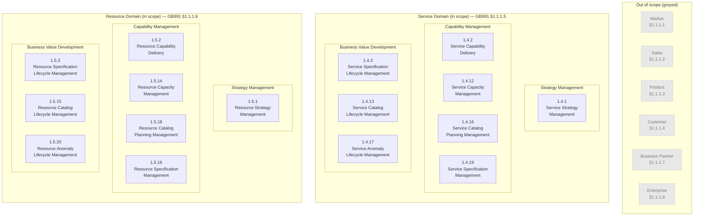

# Capability Map (S2R) — OSS Layer, Service & Resource Domains, Strategy-to-Readiness Lifecycle Area

> **Companion view.** This page is the **Strategy-to-Readiness Lifecycle Area** half of the OSS-layer capability map. Operations-area capabilities live on the sibling page [[wiki/views/capability-map]]. Both pages share L1 Frame, anchor-naming convention (`cap-<layer>-<kebab-name>`), and per-capability content shape, so heat-map overlays can compose them.
>
> **Derivative page.** This view synthesises content from authoritative wiki pages. It does not add new TMF facts. For normative claims, follow the links to source pages.
>
> **Derivation status — not a TMF-canonical map.** GB991 §1.2 (Business Capability Map) was marked **FUTURE WORK** in the TMF source — see [[wiki/open-questions#OQ-005]]. There is no TMF-canonical S2R capability map. What follows is **one defensible derivation** from in-scope eTOM L2 content (GB921 v25.5), organised on the PSR principle, scoped to the S2R Lifecycle Area (Strategy Management, Capability Management, Business Value Development) per GB991 §1.1.2.
>
> **Scope of this view.** Service Domain and Resource Domain L2s in the Strategy-to-Readiness Lifecycle Area only. 16 L2 capabilities + 6 H5 sub-capabilities (Test ×4 + Exit ×2) = **22 stable heat-map anchors on this page** (Operations-area sister carries 25 — 17 L2 + 8 H5 — for a corpus total of 47). **Phase 3 CLOSED 2026-05-12** — ingest closed in the morning (all 16 L2s); L3-derived sub-capability review closed in the afternoon (6 H5 anchors promoted across 3 clusters). 1.5.5 Resource Order Management has a BVD-vertical aspect in GB921 v25.5 alongside its primary Fulfillment + ORS verticals; it is canonical on [[wiki/views/capability-map#cap-resource-order|the Operations-area page]] and is NOT duplicated here, per the two-view-page boundary decision.
>
> **Transformation-roadmap framing.** The S2R-area capabilities map the *what-to-build* and *how-to-deliver* side of the OSS modernisation: strategy-led identification of new service/resource capabilities (Strategy), readiness-engineering and capacity planning (Capability), spec/catalog/lifecycle artefact production (BVD). Heat-map overlay across these surfaces business appetite for transformation alongside the current/target gap analysis on the Operations companion page.

## Session State

> _Authoritative resume context for this view. Updated on every state transition. A fresh Claude session reads this callout end-to-end before doing anything else. Sister-page Session State at [[wiki/views/capability-map#Session State]]; broader Phase 3 scope context at [`S2R-EXPANSION-SCOPE.md`](../../S2R-EXPANSION-SCOPE.md)._

- **Last activity:** 2026-05-12 — **PHASE 3 CLOSED — L3-derived sub-capability review complete.** Survey of 95 L3s across the 16 newly-ingested S2R L2s applied the L3-derived sub-capability convention (named L3 + substantive scope + recognised practitioner concern + cross-PSR symmetry). **Six new H5 sub-capability anchors promoted** across three clusters: **Strategy-level Test maturity** (`cap-service-strategy-test` 1.4.1.8/9 + `cap-resource-strategy-test` 1.5.1.8/9); **Lifecycle-level Test maturity** (`cap-service-specification-lifecycle-test` 1.4.3.8 + `cap-resource-specification-lifecycle-test` 1.5.3.8); **Specification end-of-life maturity** (`cap-service-specification-lifecycle-exit` 1.4.3.7 + `cap-resource-specification-lifecycle-exit` 1.5.3.7 — PSR-asymmetric L4 depth: Service 0 / Resource 4). The Test promotions complete v25.5's **3-stage × 2-PSR Test maturity row** (Strategy / Lifecycle / Operations × Service / Resource = 6 cells); cross-anchor wikilinks added on the Operations-side `cap-{service,resource}-support-test` H5s (sister page) so the row is fully connected from any entry point. Two borderline candidates rejected: capability-delivery handover (1.4.2.7 / 1.5.2.7 — surfaced as TMF distinction bullet on both Capability Delivery H4s instead, ITIL Service Transition framing); Resource-only specification version management (1.5.19.4 — kept as TMF distinction on existing H4 only). Capacity Management's Threshold/Utilization L4 cluster sanity-check confirmed: stays at L2-level TMF distinction (asymmetry sits at L4-internal decomposition, not at separable concern level). **Final stable-anchor inventory: 47 — 25 Operations + 22 S2R (16 L2 + 6 H5).** Phase 3 entirely complete (ingest CLOSED 2026-05-12 morning; sub-capability review CLOSED 2026-05-12 afternoon). Corpus is ready for user-side overlay work in `project/`.
- **Phase 3 framing decisions (locked 2026-05-10) — do not relitigate:**
    1. **Two-view-page structure** (this page + [[wiki/views/capability-map]]).
    2. **Two Mermaid diagrams** (one per view page).
    3. **Pilot first → Capability Management batch → BVD batch → L3-derived sub-capability review.**
    4. **Trilateral incremental** (per-L2 OQ filing during ingest; OQ-046 covers all 16 S2R L2 ODA cross-walks).
    5. **BVD included** for full S2R coverage.
- **Conventions inherited from `[[wiki/views/capability-map]]`:** L1 Frame (GB991 §1.1.1 horizontal domains, business-area subset); per-capability content shape (capability label H4 + HTML anchor ``; eTOM L2 italic line; provenance line if applicable; Scope verbatim or near-verbatim from L2 Overview; TMF distinctions; Source Page wikilink); naming-asymmetry preservation across PSR pairs; security-H5 / L3-derived-sub-capability conventions for heat-map sub-capabilities; TMF-pure mental-category convention (organisation-specific groupings stay in `project/`).
- **Conventions added at pilot:**
    - **Lifecycle-area italic line.** S2R capability italic lines carry three dimensions: *eTOM L2: {ID} {Name} — Vertical: {S2R vertical} — Lifecycle Area: Strategy-to-Readiness*. The Operations-area sister page uses two dimensions (eTOM L2 + OFAB vertical) because all its capabilities sit in the same Lifecycle Area.
    - **Cross-PSR navigational wikilinks in trilateral sections trigger lint errors** (per-entity bidirectional check). Use plain prose for cross-PSR navigation in those sections; wikilinks fine elsewhere (e.g. anchored intra-page H5 / L3 cross-references).
    - **Pending L2s in Mermaid frame.** All 16 S2R L2 nodes appear in the diagram from day one with `pending` styling (dashed border, muted fill). As batches land, `:::pending` is removed from the relevant nodes — diagram structure unchanged.
- **L1 Frame decision (mirrors sister page):** GB991 §1.1.1 horizontal domains, business-area subset (8 of 11). In scope for L2 decomposition: **Service**, **Resource**. Greyed (out of scope; contextual frame only): Market, Sales, Product, Customer, Business Partner, Enterprise. Non-business GB991 domains (Shared, Patterns, Integration) omitted from this view as not BPF/operations-relevant per their own GB991 definitions.
- **L2 organisation within in-scope domains:** Grouped by S2R vertical — Strategy Management → Capability Management → Business Value Development. Sourced from `GB921_…_v25.5.xlsx eTOM25,5` sheet `Vertical Group` column (2026-05-10 read).
- **Per-capability content (when populated):** capability label (H4) + HTML anchor; verbatim eTOM L2 name and ID + S2R vertical + Lifecycle Area (italic line); provenance line if applicable; scope (verbatim or near-verbatim from L2 page Overview); TMF distinction notes where corpus supports a meaningful boundary call-out (including PSR asymmetries); source-page wikilink.
- **Visualisation:** Mermaid `flowchart TB` diagram in `## L2 Capability Frame Diagram` between L1 Frame and Service Domain sections; shows all 16 in-scope S2R L2s grouped by L1 + S2R-vertical plus the 6 greyed L1 domains. Frame is fixed at framing-settlement time; capability content fills in batch by batch but the diagram doesn't change other than removal of `:::pending` styling per L2 as it lands.
- **Heat-map / overlay model:** This capability map stays pure TMF-derivative. Current-state status, Nokia mapping notes, and gap analysis live entirely in `project/` (security boundary per CLAUDE.md §10.4). The user's `project/` overlay file wikilinks the capability map's stable anchors. Claude does not read `project/` — ever.
- **Batches:**
    - **DONE:**
        1. **Strategy Management** (2026-05-10) — 2 capabilities: `cap-service-strategy`, `cap-resource-strategy`. PSR-asymmetric — Resource side carries v25.5 AI guidance throughout L3 EDs, "Strategy & Architecture" framing (vs Service-side "& Goals") with 4 L4s (vs 7), and quarterly cadence (vs annual/multi-year only). Both sides include new-in-v25.5 Test-strategy L3s (1.4.1.8/9 ↔ 1.5.1.8/9) that pair with the existing Operations-area H5 Test sub-capabilities.
        2. **Capability Management — Capability Delivery PSR pair** (2026-05-10) — 2 capabilities: `cap-service-capability-delivery` (1.4.2), `cap-resource-capability-delivery` (1.5.2). Same PSR-asymmetry shape as Strategy Management — AI/automation Resource-only; "Manage Commissioning of New Resource Infrastructure" Resource-only L4; Service-side breakouts of project-management bookkeeping. Cross-domain handoff 1.4.2.1 → 1.5.2.1 documented in source.
        3. **Capability Management — Capacity Management PSR pair** (2026-05-10) — 2 capabilities: `cap-service-capacity` (1.4.12), `cap-resource-capacity` (1.5.14). **Both L2s net-new in v25.5** (Original PID = None across the entire process tree) — first PSR pair where this is true at L2 level. PSR asymmetries: SLA/SLO/SLR contractual framing on Service side only; Service-side L2 ED carries a definition of service capacity (Resource side has no analog); L4 numbering gap on Service-side L3 1.4.12.6 (no `.6.1`; Resource-side has `.6.1 Identify Resource Capacity Optimization Need`); asymmetric L4 structure under L3 `.7` Optimize (same Adjust + Allocate L5s parented under "Manage Service Capacity Thresholds" Service-side vs "Manage Resource Capacity Utilization" Resource-side, with Resource-side carrying parallel Thresholds-management as `.7.2`); source-text copy-paste bug on L3 1.4.12.9 ED ("Resource Capacity" body text in Service-side process — preserved verbatim, OQ-045-family handling). **Notable non-asymmetry:** zero AI/automation references on either side — Capacity Management departs from the AI-on-Resource-side pattern of the previous two PSR pairs.
        4. **Capability Management — Catalog Planning PSR pair** (2026-05-11) — 2 capabilities: `cap-service-catalog-planning` (1.4.16), `cap-resource-catalog-planning` (1.5.18). **Smallest PSR pair so far** — both L2s carry only 2 L3s, no L4/L5 decomposition. Net-new in v25.5 (Original PID = None). **Most-symmetric content** of any Phase 3 PSR pair so far — L2 EDs and L3 EDs near-mirror-images between PSR sides; no content-level PSR asymmetries. Key TMF distinction surfaced: **four-L2 Catalog lifecycle** spanning both Lifecycle Areas (Planning S2R-CM → Lifecycle S2R-BVD → Operational Readiness Ops-ORS → Content Ops-ORS) — load-bearing for transformation roadmap. PSR-symmetric source-text quirk on both L3 `.1` EDs (extra qualifier word at start of ED prose). Two forward references to out-of-corpus-scope content: Specification Management (forward to 1.4.19 / 1.5.19) and "Enterprise Business Process for Catalog Management" (Enterprise governance). **Notable non-asymmetry continues:** zero AI/automation references on either side — Catalog Planning + Capacity Management both depart from the AI-on-Resource pattern of the first two PSR pairs.
        5. **Capability Management — Specification Management PSR pair** (2026-05-11) — 2 capabilities: `cap-service-specification` (1.4.19), `cap-resource-specification` (1.5.19). **Closes the Capability Management batch (4/4 PSR pairs complete).** Both net-new in v25.5. **PSR-asymmetric L3 count** — Service: 3 L3s; Resource: 4 L3s (extra `.4 Update and Version Resource Specifications` with no Service-side counterpart — Service-side version management likely deferred to BVD's Service Specification Lifecycle Management 1.4.3, pending BVD batch). **L3 naming-asymmetry on `.1` and `.2`** — "Describe" vs "Develop" / "Model" vs "Master" — slight verb-scope differences. **Significant copy-paste source-text bug on Service-side L3 1.4.19.2** — L3 name "Model **Service** Specifications" but brief + ED prose open "Model **Resource** Specifications…" — verbatim preserved, OQ-045-family. SID `service-specification-abe` and `resource-specification-abe` now each carry three eTOM back-links (primary specifications-management + capability-delivery upstream + catalog-planning scope-specific). Catalog Planning forward references from previous pair now resolve to these L2s. **AI-distribution pattern confirmed** — fourth PSR pair without AI references (Capacity, Catalog Planning, Specification Management all AI-free; only Strategy + Capability Delivery carried AI on Resource side).
        6. **BVD — Specification Lifecycle PSR pair** (2026-05-11) — 2 capabilities: `cap-service-specification-lifecycle` (1.4.3), `cap-resource-specification-lifecycle` (1.5.3). **First S2R PSR pair in Phase 3 with R20.5 lineage** (Original PIDs 1.2.2.3 / 1.2.3.3) — BVD batch is a structural break from the v25.5-net-new Capability Management batch. v24.0 rename provenance (*"Specification Development & Retirement"*). Heaviest L4 decomposition so far (17 / 21 L4s). PSR asymmetries: Exit decomposition (Resource 4 L4s vs Service 0); PSR-cascade visible at L3 .1 (Resource input includes Service + Product; Service is Product-only); L4 .6.3 naming asymmetry ("Party" vs "Supplier/Partner"); cross-version naming reference in 1.5.3 ED ("Resource Strategy & Planning" pre-v24.0 name); possible copy-paste artefact on 1.5.3.8. L3 .8 net-new in v25.5 (Test Development & Retirement) — third instance of v25.5 test-related L3 additions. Both Spec ABEs now carry four eTOM back-links each (densest pattern in corpus); both Test ABEs now carry two back-links each. **Definitive resolution of Service-side version-management asymmetry** — Service-side has no explicit version-mgmt L3 anywhere across both spec L2s (1.4.19 + 1.4.3); Resource-side has 1.5.19.4. No AI references on either side — BVD continues the AI-free pattern.
        7. **BVD — Catalog Lifecycle PSR pair** (2026-05-11) — 2 capabilities: `cap-service-catalog-lifecycle` (1.4.13), `cap-resource-catalog-lifecycle` (1.5.15). Both net-new in v25.5 — structural break from BVD pair #1 (1.4.3/1.5.3 had R20.5 lineage). Smallest L4 footprint in BVD batch (3 L3s each, no L4s). **First PSR pair with PSR-agnostic L2 EDs** — both L2 EDs literally identical word-for-word; v25.5 treats Catalog Lifecycle as a domain-agnostic governance pattern. **Most prominent source-text inconsistency cluster in Phase 3** — six bugs total (L3 body texts on both sides reference wrong sub-process names shifted by one position). **Completes the four-L2 Catalog lifecycle** structurally — Planning (S2R-CM) + Lifecycle (S2R-BVD, this pair) + Operational Readiness (Ops-ORS) + Content (Ops-ORS) all have capability anchors across both view pages. Both Spec ABEs extended to five eTOM back-links each — densest trilateral pattern in corpus extended. No AI/automation references on either side (7th of 8 PSR pairs AI-free).
        8. **BVD — Anomaly Lifecycle PSR pair** (2026-05-12) — 2 capabilities: `cap-service-anomaly-lifecycle` (1.4.17), `cap-resource-anomaly-lifecycle` (1.5.20). **Closes BVD batch (3/3 PSR pairs complete) and closes Phase 3 ingest entirely (16/16 S2R L2s).** Both net-new in v25.5 (Original PID = None throughout). **Most-symmetric L3 naming in Phase 3** — 6 identical L3 names modulo PSR substitution (Definition / Orchestrate / Monitor / Report / Intelligence / Optimization). PSR asymmetries: Service side has 5 L4s vs Resource 4 (Resource missing `.1.2` Establish Anomaly Criteria entirely; the missing Resource L4 is the buggy Service L4 that carries Product → Service body-text leakage — first Product-domain source-text leakage in Phase 3); minor 2.1-brief terminal-period asymmetry. **OODA framing** anchored in L3 .4 EDs on both sides. **First S2R PSR pair with SID forward links into Common ABE folder** — both L2s point at [[wiki/sid/common/anomaly-abe]] (production) + [[wiki/sid/common/closed-loop-abe]] («Preliminary», `release_status: draft`); both Common ABEs get their eTOM trilateral sections populated for the first time, replacing OQ-008 deferral. **Completes the two-L2 Anomaly pattern** spanning both Lifecycle Areas — third instance of v25.5's "BVD governs / Operations executes" cross-Lifecycle-Area pattern (after four-L2 Catalog and Test-strategy lineage). **AI-distribution thesis fully confirmed — 8 of 8 PSR pairs AI-free outside Strategy + Capability Delivery.** Tight-scope decision: Operations-side 1.4.18 + 1.5.21 forward links to anomaly-abe + closed-loop-abe **not** opportunistically populated (deferred as Phase-4 broader-trilateral-sweep candidate per OQ-008).
        9. **Phase 3 closing — L3-derived sub-capability review** (2026-05-12) — Survey of 95 L3s across the 16 newly-ingested S2R L2s. **6 H5 anchors promoted** across 3 clusters: Strategy-level Test (`cap-service-strategy-test` + `cap-resource-strategy-test` — 1.4.1.8/9 + 1.5.1.8/9); Lifecycle-level Test (`cap-service-specification-lifecycle-test` + `cap-resource-specification-lifecycle-test` — 1.4.3.8 + 1.5.3.8); Specification end-of-life (`cap-service-specification-lifecycle-exit` + `cap-resource-specification-lifecycle-exit` — 1.4.3.7 + 1.5.3.7, PSR-asymmetric L4 depth). 2 borderline rejections: Capability-Delivery handover (1.4.2.7 / 1.5.2.7 — added as TMF distinction bullets, ITIL framing); Resource-only spec version mgmt (1.5.19.4 — kept as existing TMF distinction). Cross-anchor wikilinks added on Operations-side `cap-{service,resource}-support-test` H5s on the sister page completing the **3-stage × 2-PSR Test maturity row**. Final inventory: 47 stable heat-map anchors (25 Ops + 22 S2R = 16 L2 + 6 H5).
    - **IN-PROGRESS:** _(none — Phase 3 entirely closed 2026-05-12.)_
    - **PENDING:** _(none — corpus ready for user-side overlay work in `project/`.)_
- **Pending decisions:**
    - **CLAUDE.md §3 amendment** — required to bring the binding constitution in line with the now-expanded Phase 3 scope (Strategy / Capability / BVD verticals previously excluded as SIP-vertical out of scope). Will be drafted as a separate proposal at the **user-pause-for-review checkpoint** that follows this pilot deliverable.
- **Provenance-line convention (inherited from sister page Batch 3):** When a TMF L2 has a documented version-rename, surface it as a second italic line *immediately above* the Scope block (under the `eTOM L2:` italic line). Pilot ingest applied this twice — both Strategy Management L2s carry v24.0 renames ("Service/Resource Strategy & Planning" → "Service/Resource Strategy Management").
- **Naming-asymmetry convention (inherited from sister page Batch 4):** Where TMF-source uses different terms for PSR analogs, preserve the asymmetry in capability labels per eTOM-aligned framing. **No PSR naming asymmetries observed across Phase 3** — all 16 ingested S2R L2 names are PSR-symmetric (Service ↔ Resource label substitution clean across all 8 pairs). The naming-asymmetry convention applies to other Phase observations (e.g. Operations-area Service Problem ↔ Resource Trouble Management) but not to S2R-area work.
- **Next action:** _(none from Phase 3 — corpus structurally and content-complete against original goal. User-side overlay work in `project/` is unblocked. Future phases — corpus maintenance, ODA-layer trilateral sweep, possible Phase 4 broader-trilateral fills (Operations-side Anomaly L2s → Common ABEs; Resource-only candidates that failed cross-PSR-symmetry test) — surface only on user prompt.)_

## Purpose

This view is a derived capability map intended as the **Strategy-to-Readiness half of a transformation-roadmap frame**: a stable set of TMF-aligned strategy / capability / lifecycle capabilities organised on the PSR principle, against which a practitioner can overlay current-state status (present / partial / different / missing) maintained separately in user-private notes. Together with [[wiki/views/capability-map]] (Operations area), the two pages form the complete OSS-layer capability frame for current → target architecture mapping.

The map's value comes from making PSR-driven boundaries between strategic-planning and capability-delivery concerns visible — boundaries that monolithic, code-driven BSS/OSS implementations typically don't have at all (because the *what-to-build* layer is implicit in the code, and the spec/catalog artefact lifecycle layer doesn't exist as a distinct concern in the absence of TMF-aligned modelling). Surfacing them is the precondition for transformation roadmap planning.

The anchor IDs on each capability (`cap-<layer>-<kebab-name>`) are stable so user-private overlay files (in the project's `project/` area, which Claude does not read) can wikilink-reference them without breaking when the map evolves.

## L1 Frame

GB991 §1.1.1 defines eleven horizontal domains. For an S2R-area capability map, the eight business-area domains form the L1 frame. Two are in scope for full L2 decomposition; six are present as greyed context — they bound what is intentionally NOT in this view's scope, with one-click links out to the foundation domain definitions for reference.

| Domain | Status | Definition |
|---|---|---|
| Market | _Greyed — out of scope for this view_ | [[wiki/foundations/domains#Market Domain]] (GB991 §1.1.1.1) |
| Sales | _Greyed — out of scope for this view_ | [[wiki/foundations/domains#Sales Domain]] (GB991 §1.1.1.2) |
| Product | _Greyed — out of scope for this view_ | [[wiki/foundations/domains#Product Domain]] (GB991 §1.1.1.3). Note: corpus contains 12 in-scope Product Domain L2 pages from GB921; they are preserved on their source pages but not surfaced as capabilities in this view. |
| Customer | _Greyed — out of scope for this view_ | [[wiki/foundations/domains#Customer Domain]] (GB991 §1.1.1.4) |
| **Service** | **In scope — L2 decomposition below** | [[wiki/foundations/domains#Service Domain]] (GB991 §1.1.1.5) |
| **Resource** | **In scope — L2 decomposition below** | [[wiki/foundations/domains#Resource Domain]] (GB991 §1.1.1.6) |
| Business Partner | _Greyed — out of scope for this view_ | [[wiki/foundations/domains#Business Partner Domain]] (GB991 §1.1.1.7). Includes Suppliers and Partners. |
| Enterprise | _Greyed — out of scope for this view_ | [[wiki/foundations/domains#Enterprise Domain]] (GB991 §1.1.1.8). Corporate / Finance / HR support functions. |

Three further GB991 horizontal domains are omitted from this view by their own GB991 definitions: **Shared** (§1.1.1.9 — *"specialized for use in the Information Framework (SID) and the Functional Framework"*; not a BPF/operations domain), **Patterns** (§1.1.1.10 — SID-only abstract patterns), **Integration** (§1.1.1.11 — business-agnostic infrastructure / middleware).

## L2 Capability Frame Diagram

The frame below shows all 16 in-scope S2R L2 capabilities grouped by L1 horizontal domain and S2R vertical, plus the six greyed L1 domains that bound this view's scope. Capability nodes carry their eTOM L2 ID; greyed L1 domains carry the GB991 §1.1.1 reference. The diagram is the same canvas a heat-map overlay would colour — capability content (the H4 sections that follow) fills in batch by batch, but this frame is fixed. Pending L2s (capability content not yet populated below) are styled with dashed border and muted fill; ingested L2s are plain.

`*` 1.5.5 Resource Order Management has a BVD-vertical aspect in GB921 v25.5 (alongside its primary Fulfillment + ORS verticals); it is canonical on [[wiki/views/capability-map#cap-resource-order|the Operations-area page]] and is not duplicated here. Future Phase 4 may revisit if the BVD-aspect of Resource Order needs separate heat-map cell.

## Service Domain — L2 Capabilities (in scope, S2R area)

_Strategy Management vertical complete (pilot 2026-05-10). Capability Management and Business Value Development verticals pending — see Session State for ingest plan._

### Strategy Management

#### Service Strategy Management

*eTOM L2: 1.4.1 Service Strategy Management — Vertical: Strategy Management — Lifecycle Area: Strategy-to-Readiness*
*Rename history (per GB921 v25.5 source note): renamed in v24.0 from "Service Strategy & Planning".*

**Scope.** Service Strategy Management processes enable the development of a strategic view and a multi-year business plan for the enterprise's services and service directions, and the parties who will supply the required services. Research and analysis is performed to determine service targets as well as strategies to reach the defined targets, drawing from external market, internal research and other internal knowledge. A key input arises from the enterprise's market and product portfolio strategy and forecasts. A focus is placed on the expansion of existing service capabilities and the identification of new service capabilities required.

These processes deliver and develop annual and multi-year service plans in support of products and offers (volume forecasts, resource-level negotiation, supply-chain commitment, executive approval). They define service standards sought, key new service capabilities required, service support levels and approaches, service design elements to be developed, service cost parameters and targets, and the policies relating to technical services and their implementation.

— GB921 v25.5

**TMF distinctions.**
- **Upstream input to Capability Delivery (1.4.2 → `cap-service-capability-delivery`).** Strategy Management defines *what* new capabilities are required; Capability Management is responsible for *delivering* them. Boundary matters for transformation-roadmap clarity — strategy maturity is independent of delivery maturity. Forward link target — wired up when 1.4.2 ingests.
- **Test Strategy paired with operational Test execution.** L3 1.4.1.8 Service Test Strategy and L3 1.4.1.9 Analyze Service Test Quality (both new in v25.5) sit upstream of L3 1.4.4.6 Manage Service Test, which is the H5 sub-capability anchor [[wiki/views/capability-map#cap-service-support-test|`cap-service-support-test`]] in the Operations-area view. Heat-map composability — a transformation initiative on Test capability touches both pages.
- **Distinct from the Service Strategy & Plan ABE (source-tagged «notFullyDeveloped»).** The L2 is the *process* producing the strategic artefacts; the SID side ABE [[wiki/sid/service/service-strategy-and-plan-abe]] models the artefacts themselves. Both are load-bearing for OSS-modernisation roadmap; both flag partial maturity (the SID side is source-tagged «notFullyDeveloped»).
- **No PSR naming asymmetry vs Resource side.** 1.4.1 ↔ 1.5.1 are symmetric "Service / Resource Strategy Management" labels. PSR asymmetries in this pair are *content* asymmetries (see 1.5.1's TMF distinctions).

**Source page.** [[wiki/etom/service-domain/service-strategy-management]]

##### Test management strategy (heat-map sub-capability)

GB921 v25.5 carries two dedicated Strategy-level L3 processes for Service Test under this L2 (both new in v25.5; Original PIDs = None):

- **1.4.1.8 Service Test Strategy** — *"Service Test Strategy develops the strategies of the enterprise for Service Test. This process is in charge of identifying types of Service Test to be conducted according to different context (i.e. business activities) for types of Services."* The L3 ED enumerates five contexts for Service Test: Service Development & Retirement (qualify the capacity to deliver Services before validating a new ServiceSpecification); Service Configuration & Activation (test the Service before closing the ServiceOrderItem); Service Quality Management (Quality testing); Service Problem Management (functional testing); Service Test Management (tests not specific to a customer's product). — GB921 v25.5, 1.4.1.8
- **1.4.1.9 Analyze Service Test Quality** — *"Analyze Service Test Quality process performs quality analysis of service testing processes, in order to continuously fine-tune and improve them."* Provides offline analysis of testing-process performance using statistical service-test-usage data; proposes modifications to service test specifications (methods, quotas, authorized users, recommendations). Course-of-action enumeration: no changes; create additional tests; improve existing tests; remove tests no longer relevant. — GB921 v25.5, 1.4.1.9

(No L4 sub-processes documented for either L3 in GB921 v25.5 Excel master.)

**Strategy-level test maturity — first cell in the cross-Lifecycle Test row.** Together with the Lifecycle-level [[#cap-service-specification-lifecycle-test|`cap-service-specification-lifecycle-test`]] (test catalogue dev/retirement, 1.4.3.8) and the Operations-level [[wiki/views/capability-map#cap-service-support-test|`cap-service-support-test`]] (test execution, 1.4.4.6), this anchor forms the Service-side leg of v25.5's **3-stage × 2-PSR Test maturity row**:

|  | Strategy | Lifecycle | Operations |
|---|---|---|---|
| Service | **`cap-service-strategy-test`** (this) | [[#cap-service-specification-lifecycle-test\|`cap-service-specification-lifecycle-test`]] | [[wiki/views/capability-map#cap-service-support-test\|`cap-service-support-test`]] |
| Resource | [[#cap-resource-strategy-test\|`cap-resource-strategy-test`]] | [[#cap-resource-specification-lifecycle-test\|`cap-resource-specification-lifecycle-test`]] | [[wiki/views/capability-map#cap-resource-support-test\|`cap-resource-support-test`]] |

Heat-map readers can mark Strategy-level test maturity (do we *think* about test types per business activity? do we *analyse* test quality offline?) independently of Lifecycle-level (do we manage a Service Test catalogue with detailed roles, quotas, methods, thresholds?) and Operations-level (do we *execute* tests on demand or planned, manual or automated?).

Stable sub-anchor `cap-service-strategy-test` for heat-map overlay.

### Capability Management

_First PSR pair complete (Capability Delivery, 2026-05-10). Three more pairs pending — Capacity Management, Catalog Planning Management, Specification Management._

#### Service Capability Delivery

*eTOM L2: 1.4.2 Service Capability Delivery — Vertical: Capability Management — Lifecycle Area: Strategy-to-Readiness*

**Scope.** Service Capability Delivery processes plan and deliver the total capabilities required to deliver changes to service, as necessary. This involves integration of capability delivered from within the enterprise, and capability delivered from an external party. Service demand forecasting and capturing of new opportunities are essential to ensure the enterprise can implement the services necessary for the future needs of customers.

The L2 decomposes into 7 L3s covering the full capability-delivery lifecycle: (1.4.2.1) Map & Analyze Service Requirements; (1.4.2.2) Capture Service Capability Shortfalls (capacity / performance / operational support); (1.4.2.3) Gain Service Capability Investment Approval; (1.4.2.4) Design Service Capabilities; (1.4.2.5) Enable Service Support & Operations; (1.4.2.6) Manage Service Capability Delivery (program/project management; 6 L4s including delivery timetables, expenditure tracking, financial accountability); (1.4.2.7) Manage Handover to Service Operations.

— GB921 v25.5

**TMF distinctions.**
- **Receives upstream input from Service Strategy Management** (1.4.1 → [[#cap-service-strategy|`cap-service-strategy`]]). L3 1.4.2.3 explicitly takes input from the Map & Analyze Service Requirements process plus Service Capability Shortfalls plus Define Product Capability Requirements. The Strategy → Capability Delivery handoff is the operational expression of the *what-to-build* layer of OSS modernisation.
- **Cross-domain handoff to Resource Capability Delivery** (1.4.2.1 → 1.5.2.1 → [[#cap-resource-capability-delivery|`cap-resource-capability-delivery`]]). The closing sentence of L3 1.4.2.1's ED — *"These processes provide input into the requirements capture processes in the Resource and Engaged party domains"* — is the documented entry into the Service-to-Resource Capability-Management chain. This handoff is **load-bearing for transformation roadmap clarity**: a current OSS that conflates service-design and resource-design (or that has neither as a distinct concern because the work happens in code) loses this boundary.
- **Sourcing forward references.** L3 1.4.2.4 and 1.4.2.6 reference "Engaged Party domains" for sourcing process management. Asymmetric to Resource side, which references "Party Offering Development & Retirement processes" + "Supply Chain Development & Management processes" — three different downstream-process names across the PSR pair. Engaged Party / Business Partner domain is itself out of corpus L1 scope.
- **vs Service Strategy Management** (1.4.1): Strategy defines *what* new capabilities are required; Capability Delivery is responsible for *delivering* them. Boundary is load-bearing for the transformation roadmap — strategy maturity is independent of delivery maturity.
- **Operational handover stage — ITIL Service Transition framing.** L3 1.4.2.7 *Manage Handover to Service Operations* (3 L4s — Co-ordinate / Validate / Ensure Support) governs the gating step between newly-delivered service infrastructure and operational control. Practitioner-recognised concern (ITIL Service Transition / DevOps "release-to-prod" framing). **Considered for H5 sub-capability promotion at Phase 3 closing review (2026-05-12) and rejected** on the basis that handover is a stage *within* capability delivery (only happens at the end), not a cross-cutting concern exercised across multiple processes — fails the cross-cutting test that workforce / inventory / test / security all pass. Heat-map relevance preserved at L2 level via this bullet; practitioners specifically interested in handover/release maturity can interpret the L2 cell with that framing in mind.

**Source page.** [[wiki/etom/service-domain/service-capability-delivery]]

#### Service Capacity Management

*eTOM L2: 1.4.12 Service Capacity Management — Vertical: Capability Management — Lifecycle Area: Strategy-to-Readiness*
*Net-new in v25.5 — Original Process Identifier = None (no R20.5 / pre-v25 lineage; entire process tree v25.5-introduced).*

**Scope.** Service Capacity Management business processes manage the activities required to ensure a business is able to plan, analyze, optimize, monitor and report on capacity and constraints associated to services in response to business requirements (e.g. SLRs) and objectives (e.g. SLAs, SLOs etc.).

Service capacity is the volume of activity that a service offered can handle while maintaining standards of quality and performance. The L2 decomposes into 9 L3s covering the full capacity-management lifecycle: Plan, Align, Establish GAP, Forecast, Implement, Analyze, Optimize, Monitor, Report.

— GB921 v25.5

**TMF distinctions.**
- **Net-new in v25.5.** Capacity Management as a dedicated L2 didn't exist as a separate process in pre-v25 GB921. **Heat-map relevance for the transformation roadmap** — current OSS implementations may have de facto capacity management distributed across other functions (typically inside infrastructure-monitoring tooling or as code in service-orchestration logic); v25.5 establishes capacity management as a discrete capability deserving its own maturity assessment.
- **SLA / SLO / SLR contractual framing — Service-side only.** L2 brief and four L3 EDs (1.4.12.1, .2, .3, .5.1) reference Service Level Agreements / Objectives / Requirements explicitly. The Resource-side analog L2 [[#cap-resource-capacity|`cap-resource-capacity`]] has zero SLA/SLO/SLR references — Resource Capacity Management is framed against "business objectives" + "operational conditions" without contractual framing. Reflects the PSR boundary: Service Capacity is contractable (customer-facing); Resource Capacity is infrastructure-side.
- **Definitional anchor in the L2 ED.** Service-side L2 ED includes a definition: *"Service capacity is the volume of activity that a service offered can handle while maintaining standards of quality and performance."* Resource-side has no analogous definition of resource capacity. Asymmetric L2-level framing.
- **L4 numbering gap on L3 1.4.12.6.** Service-side has `.6.2`, `.6.3`, `.6.4` — no `.6.1`. Resource-side has `.6.1 Identify Resource Capacity Optimization Need`. Source-text quirk; Service-side has no analog for "Identify Optimization Need" at L4 level. Preserved verbatim on the [[wiki/etom/service-domain/service-capacity-management|source page]].
- **L4 / L5 asymmetry under L3 `.7` Optimize.** Service-side has 1 L4 (`.7.1 Manage Service Capacity Thresholds`) with 2 L5s (`.7.1.1 Adjust`, `.7.1.2 Allocate`). Resource-side has 2 L4s (`.7.1 Manage Utilization` with same Adjust+Allocate L5s + `.7.2 Manage Thresholds` as parallel sibling). Same L5 names parented under different L4 names across the PSR pair.
- **Source-text bug on L3 1.4.12.9 ED.** The Service-side Report L3 contains "Resource Capacity" body text (verbatim copy-paste from the Resource-side mirror page without the Service substitution). Intent unambiguously Service Capacity given the L2 / L3 context. Preserved verbatim on source page; pattern matches OQ-045 family handling — no separate OQ filed.
- **No AI / automation references on either PSR side.** **Notable non-asymmetry** — Capacity Management L2s departs from the Resource-side-AI-heavy pattern of the previous two PSR pairs (Strategy Management 1.4.1/1.5.1, Capability Delivery 1.4.2/1.5.2). v25.5 didn't apply the AI-readiness commentary uniformly across S2R verticals.
- **vs Service Capability Delivery** ([[#cap-service-capability-delivery|`cap-service-capability-delivery`]]): Capability Delivery (1.4.2) captures capacity *shortfalls* as upstream input (L3 1.4.2.2.1) and establishes anticipated demand+performance views (L3 1.4.2.1) — these are episodic / project-driven uses of capacity data. Capacity Management (1.4.12) is the *primary ongoing-management* of capacity end-to-end. Both manipulate the [[wiki/sid/service/service-capacity-abe|Service Capacity ABE]]; the boundary is upstream-input vs ongoing-management.

**Source page.** [[wiki/etom/service-domain/service-capacity-management]]

#### Service Catalog Planning Management

*eTOM L2: 1.4.16 Service Catalog Planning Management — Vertical: Capability Management — Lifecycle Area: Strategy-to-Readiness*
*Net-new in v25.5 — Original Process Identifier = None (no R20.5 / pre-v25 lineage).*

**Scope.** Service Catalog Planning Management business processes cover a set of business activities that understand and enable establishing the plan to define, design and operationalize a catalog in order to meet the needs and objectives of Service cataloging. Ensures the organization identifies the most appropriate scheme and goal for its catalog. Includes designing the Catalog plan and developing the catalog specification according to Service management requirements.

The L2 decomposes into 2 L3s (smallest L2 in the S2R area so far): (1.4.16.1) Design Service Catalog Plan; (1.4.16.2) Define Service Catalog Specification. No L4 / L5 decomposition in source.

— GB921 v25.5

**TMF distinctions.**
- **Net-new in v25.5.** Catalog Planning as a dedicated L2 didn't exist as a separate process in pre-v25 GB921.
- **Four-L2 Catalog lifecycle across both Lifecycle Areas — load-bearing for the transformation roadmap.** GB921 v25.5 frames Service Catalog work as a four-stage lifecycle visible across both view pages:
    - **Planning** (this capability, S2R / Capability Management — `cap-service-catalog-planning`) — designing the catalog itself: scheme, goal, plan, specification
    - **Lifecycle Management** (S2R / BVD — 1.4.13, pending Phase 3 BVD batch → `cap-service-catalog-lifecycle`) — catalog versioning / artefact lifecycle
    - **Operational Readiness** (Operations / ORS — 1.4.14, already in corpus → [[wiki/views/capability-map#cap-service-catalog-operational-readiness|`cap-service-catalog-operational-readiness`]])
    - **Content Management** (Operations / ORS — 1.4.15, already in corpus → [[wiki/views/capability-map#cap-service-catalog-content|`cap-service-catalog-content`]])
  
  A current OSS that *has a service catalog* typically has it without these stage boundaries — catalog work is conflated into a single concern. Surfacing the four stages is the precondition for transformation-roadmap clarity on catalog maturity. Heat-map overlays composing across both view pages can render catalog maturity as a four-cell row rather than a single cell.
- **Most-symmetric PSR pair so far.** Content of 1.4.16 ↔ 1.5.18 is near-mirror-image between Service and Resource sides — no SLA/SLO/SLR Service-only framing, no AI/automation Resource-only framing, no structural-asymmetry callouts. v25.5 framing of catalog planning is genuinely PSR-symmetric at the process level. Where the asymmetry lives is in the *underlying SID side* (the Service Catalog ABE has CFSSpec/RFSSpec distinction the Resource Catalog ABE does not).
- **PSR-symmetric source-text quirk** on L3 `.1` ED prose — extra "Service" qualifier word at start (*"Service Design Catalog Plan business activity…"* vs the L3 name *"Design Service Catalog Plan"*). Same pattern on Resource-side analog 1.5.18.1. Preserved verbatim on source pages.
- **Forward references** in L3 1.4.16.2 ED: "Specification Management business activities" → forward to [[#cap-service-specification|`cap-service-specification`]] (1.4.19, pending Phase 3 final Capability Management pair); "Enterprise Business Process for Catalog Management" → governance reference to Enterprise-domain content (out of L1 scope per CLAUDE.md §3).
- **vs Service Capability Delivery** ([[#cap-service-capability-delivery|`cap-service-capability-delivery`]]): both manipulate [[wiki/sid/service/service-specification-abe|Service Specification ABE]], but with different scope. 1.4.2 produces *service infrastructure* design specifications (CFSSpec / RFSSpec characteristics for service capabilities); 1.4.16 produces *catalog* specifications (Service Catalog sub-ABE §4.3.3 — what fields / schema / design requirements the catalog supports). Same SID ABE, different sub-ABE scope.

**Source page.** [[wiki/etom/service-domain/service-catalog-planning-management]]

#### Service Specification Management

*eTOM L2: 1.4.19 Service Specification Management — Vertical: Capability Management — Lifecycle Area: Strategy-to-Readiness*
*Net-new in v25.5 — Original Process Identifier = None.*

**Scope.** Service Specification Management business processes leverage captured service requirements to develop, master, analyze, and update documented standard conditions that must be satisfied by service design and/or delivery. Can result in establishing technical (know-how) standards in a centralized way; provides the organization with a means to control and approve the values and inputs of service specification through structure, review, approval and distribution processes to stakeholders and suppliers.

The L2 decomposes into 3 L3s: (1.4.19.1) Describe Service Specifications — with 2 L4s (Describe Property, Align); (1.4.19.2) Model Service Specifications; (1.4.19.3) Analyze Service Specifications. **No L3-level version-management activity** — see TMF distinctions below.

— GB921 v25.5

**TMF distinctions.**
- **Net-new in v25.5.** Same as other Capability Management L2s introduced in v25.5.
- **Closes a three-L2 Specification-data-management triad on the Service side**, all manipulating [[wiki/sid/service/service-specification-abe|Service Specification ABE]] with distinct scopes:
    - **This L2 (1.4.19)** — primary specifications-management process (full describe-model-analyze lifecycle of the spec artefact).
    - [[#cap-service-capability-delivery|`cap-service-capability-delivery`]] (1.4.2) — upstream-input manipulator producing service-infrastructure-design specs as part of capability-delivery flow.
    - [[#cap-service-catalog-planning|`cap-service-catalog-planning`]] (1.4.16) — catalog-planning-specific manipulator producing Service Catalog sub-ABE (§4.3.3) artefacts.
    
    The same SID ABE carries three distinct eTOM-process roles. **Heat-map relevance for transformation roadmap** — current OSS that has "service specifications" likely doesn't distinguish these three manipulator scopes; treating them as separate heat-map cells exposes specification-data-management maturity at finer granularity.
- **Back-references resolve forward references from Catalog Planning.** L3 1.4.16.2 Define Service Catalog Specification ED references "Specification Management business activities" — those activities live in this L2's three L3s. Specification Management is the lower-level activity-set that Catalog Planning leverages.
- **PSR L3-count asymmetry vs Resource-side.** Service has 3 L3s; Resource side ([[#cap-resource-specification|`cap-resource-specification`]]) has 4 L3s — the Resource-only `.4 Update and Version Resource Specifications` is the asymmetric one. Service-side version management likely lives in the BVD-vertical Service Specification Lifecycle Management (1.4.3, pending Phase 3 BVD batch). When 1.4.3 ingests, this Service Specification Management H4 should back-reference it.
- **PSR L3-name semantic asymmetry on `.1` and `.2`.** Service uses "Describe" (`.1`) + "Model" (`.2`); Resource uses "Develop" (`.1`) + "Master" (`.2`). Different verbs, similar scope. Preserved verbatim per naming-asymmetry convention.
- **Source-text copy-paste bug on L3 1.4.19.2.** L3 name says "Model **Service** Specifications" but brief + ED prose open "Model **Resource** Specifications business activity represents the understanding of collections of **service** specifications…" — Service-side body was copy-pasted from the Resource-mirror without full PSR substitution. **Most prominent source-text bug in the Phase 3 ingest.** Verbatim preserved on the [[wiki/etom/service-domain/service-specification-management#1.4.19.2 Model Service Specifications|source page]]; OQ-045-family handling; no separate OQ.
- **No AI / automation references on either PSR side.** Continues the emerging pattern observed since Capacity Management and Catalog Planning — v25.5 AI commentary appears concentrated in Strategy + Capability Delivery, absent from Capacity / Catalog Planning / Specification Management. Pattern crystallised across four PSR pairs.

**Source page.** [[wiki/etom/service-domain/service-specification-management]]

### Business Value Development

_First BVD PSR pair complete (Specification Lifecycle, 2026-05-11). Two more pairs pending — Catalog Lifecycle, Anomaly Lifecycle._

#### Service Specification Lifecycle Management

*eTOM L2: 1.4.3 Service Specification Lifecycle Management — Vertical: Business Value Development — Lifecycle Area: Strategy-to-Readiness*
*Renamed in v24.0 — old name "Service Specification Development & Retirement". R20.5 lineage (Original PID 1.2.2.3).*

**Scope.** Service Specification Lifecycle Management processes are project oriented in that they develop and deliver new or enhanced service types. These processes include process and procedure implementation, systems changes and customer documentation. They also undertake rollout and testing of the service type, capacity management and costing of the service type. It ensures the ability of the enterprise to deliver service types according to requirements.

The L2 decomposes into 8 L3s — heaviest L4 decomposition in Phase 3 so far (17 L4s): (1.4.3.1) Gather & Analyze New Service Ideas; (1.4.3.2) Assess Performance of Existing Services; (1.4.3.3) Develop New Service Business Proposal; (1.4.3.4) Develop Detailed Service Specifications; (1.4.3.5) Manage Service Development; (1.4.3.6) Manage Service Deployment; (1.4.3.7) Manage Service Exit (no L4 decomposition); (1.4.3.8) Service Specification Test Development & Retirement (new in v25.5).

— GB921 v25.5

**TMF distinctions.**
- **R20.5 lineage — first S2R PSR pair in Phase 3 with pre-v25 history.** Capability Management was uniformly v25.5-net-new (Original PID = None on all 8 L2s). BVD batch has pre-v25 lineage: R20.5 carried "Specification Development & Retirement" as the SIP-vertical L2, v24.0 renamed to "Specification Lifecycle Management", v25.5 re-grouped under Business Value Development. **Heat-map relevance for transformation roadmap** — Service Specification Lifecycle work is a long-established TMF capability, unlike the Capability Management L2s which are newer concerns; a current OSS that does service-class development likely already addresses some part of this L2's scope (whereas Capacity Management or Catalog Planning may be genuinely greenfield).
- **Cross-L2 boundary with Service Capability Delivery.** L3 1.4.3.5 ED explicitly forward-references [[#cap-service-capability-delivery|`cap-service-capability-delivery`]] (1.4.2) for major infrastructure delivery: *"management of major new or enhanced infrastructure delivery to support service development is managed within the Service Capability Delivery process."* Spec Lifecycle develops the *spec content* + project-managed class deployment; Capability Delivery does the *major infrastructure delivery* underneath. Distinct concerns, related work.
- **Closes the four-L2 Specification-ABE manipulator pattern on the Service side.** The Service Specification ABE now carries four eTOM back-links distinguishing temporal scope:
    - [[#cap-service-specification|`cap-service-specification`]] (1.4.19) — ongoing-maintenance scope.
    - [[#cap-service-capability-delivery|`cap-service-capability-delivery`]] (1.4.2) — project-driven-design scope.
    - [[#cap-service-catalog-planning|`cap-service-catalog-planning`]] (1.4.16) — catalog-system-design scope.
    - **This L2 (1.4.3)** — class-introduction-to-retirement scope.
    
    Densest trilateral pattern in the corpus. **Heat-map composability** — four discrete cells on the same SID artefact representing different practitioner-meaningful activity scopes.
- **PSR-asymmetric Exit decomposition.** L3 1.4.3.7 Manage Service Exit has **0 L4s**. The Resource-side analog [[#cap-resource-specification-lifecycle|`cap-resource-specification-lifecycle`]] L3 1.5.3.7 has 4 L4s (Identify Unviable, Identify Impacted Customers, Develop Transition Strategies, Manage Exit Process). Resource side has explicit exit-step breakdown; Service side keeps Exit at L3-narrative only.
- **PSR cascade visible at L3 `.1`.** Service-side input is Product-only ("specific product requirements"); Resource-side input is Product + Service. Reflects the canonical PSR cascade: Product → Service → Resource at the requirements layer.
- **L3 .8 — new in v25.5 — Service Specification Test Development & Retirement.** Third Phase 3 instance of v25.5 introducing test-related L3s into pre-existing process groups. L3 .8 manages the Service Test catalogue (roles, methods, rules, thresholds, **lower-level Resource Test relationships**, scenarios). Service Test is positioned as a higher-level test consuming Resource Test results — explicit PSR-test cascade.
- **Definitive resolution of the Service-side version-management asymmetry.** Earlier hypothesis was that 1.5.19.4's Resource-only Update-and-Version L3 might have a Service-side analog in 1.4.3. **Confirmed not the case.** 1.4.3.5 covers Service-class upgrades/enhancements implicitly within Manage Service Development; no dedicated version-management L3 exists anywhere on the Service side across either 1.4.19 (Specification Mgmt) or 1.4.3 (Specification Lifecycle Mgmt). Resource side has explicit 1.5.19.4. PSR asymmetry is genuine and definitive.
- **No AI / automation references.** Continues the emerging pattern. BVD following the Capability-Management-batch-AI-free trend.

**Source page.** [[wiki/etom/service-domain/service-specification-lifecycle-management]]

##### Test catalogue development & retirement (heat-map sub-capability)

GB921 v25.5 carries a dedicated Lifecycle-level L3 process for Service Test catalogue management under this L2 (new in v25.5; Original PID = None):

- **1.4.3.8 Service Specification Test Development & Retirement** — *"Service Test Development & Retirement is in charge of the Service Test catalogue. A type of Service Test aims at measuring proper functioning and capacities of a Service."* The L3 ED enumerates the catalogue specification responsibilities — for each Service Test: roles authorized to use the Test and quotas per role; method to conduct the Test; rules defining test strategies (including the test plan); thresholds and related actions; **relationships with lower-level tests (Resource Test)**; rules for enrichment of Resource Tests results per role asking for it. Plus test-scenario specification (sequences of Tests with context/planning rules; allowed roles + quotas). — GB921 v25.5, 1.4.3.8

(No L4 sub-processes documented in GB921 v25.5 Excel master.)

**Lifecycle-level test maturity — middle cell in the cross-Lifecycle Test row.** Sits between the Strategy-level [[#cap-service-strategy-test|`cap-service-strategy-test`]] (1.4.1.8/9 — Test types and quality analysis) and the Operations-level [[wiki/views/capability-map#cap-service-support-test|`cap-service-support-test`]] (1.4.4.6 — Test execution). Where Strategy-level decides *which* tests to do and Operations-level *executes* tests, Lifecycle-level **owns the Test catalogue** — the spec artefact that defines what each Test means.

**Cross-PSR test composition surfaces here in source.** L3 1.4.3.8 ED explicitly states the Service Test Development includes *"the relationships with lower level tests (Resource Test)"* — Service Test catalogue is positioned as a higher-level test composing Resource Test results. Heat-map readers should expect this cell's maturity to depend on Resource-side test catalogue maturity ([[#cap-resource-specification-lifecycle-test|`cap-resource-specification-lifecycle-test`]] — 1.5.3.8) plus Operations-level Resource Test execution ([[wiki/views/capability-map#cap-resource-support-test|`cap-resource-support-test`]] — 1.5.4.9).

Stable sub-anchor `cap-service-specification-lifecycle-test` for heat-map overlay.

##### Service end-of-life management (heat-map sub-capability)

GB921 v25.5 carries a dedicated L3 process for Service end-of-life / decommissioning under this L2:

- **1.4.3.7 Manage Service Exit** — *"The Manage Service Exit processes identify existing service classes which are unviable and manage the process to exit the Service from the products they support. The processes analyze existing service classes to identify economically or strategically unviable classes, identify products & customers impacted by any exit, develop product & customer specific exit or migration strategies, develop service infrastructure transition and/or replacement strategies, and manage the operational aspects of the exit process. A business proposal identifying the competitive threats, risks and costs may be required as a part of developing the exit strategy. These processes include any interaction with cross-enterprise co-ordination and management functions to ensure that the needs of all stakeholders are identified and managed."* — GB921 v25.5, 1.4.3.7

(No L4 sub-processes documented for 1.4.3.7 in GB921 v25.5 Excel master — narrative-only at L3 level on Service side.)

**Decommissioning maturity — separable from broader spec-lifecycle maturity.** End-of-life management is a distinct organisational concern: an org can have mature spec-development capability and immature service-retirement capability (sunset projects routinely under-resourced compared to launch projects). Heat-map overlay can mark this cell independently. The narrative-only L3 (no L4 decomposition) reflects that Service-side exit is largely customer-migration + catalogue-cleanup work, less operationally demanding than physical-resource exit.

**PSR-asymmetric decomposition — Service narrative vs Resource L4-decomposed.** The Resource-side analog [[#cap-resource-specification-lifecycle-exit|`cap-resource-specification-lifecycle-exit`]] (1.5.3.7) carries 4 explicit L4s (Identify Unviable / Identify Impacted / Develop Transition / Manage Exit Process); Service-side is narrative-only. **The asymmetry is itself heat-map-relevant** — surfaces the practitioner observation that resource decommissioning (physical equipment, legacy systems, migration paths) is operationally more demanding than service decommissioning. Both PSR sides get their own anchor; heat-map cells calibrate against the asymmetric source-depth.

Stable sub-anchor `cap-service-specification-lifecycle-exit` for heat-map overlay.

#### Service Catalog Lifecycle Management

*eTOM L2: 1.4.13 Service Catalog Lifecycle Management — Vertical: Business Value Development — Lifecycle Area: Strategy-to-Readiness*
*Net-new in v25.5 — Original Process Identifier = None (no R20.5 / pre-v25 lineage).*

**Scope.** Catalog Lifecycle Management business processes cover business activities that enable managing the lifecycle of an organization's catalog from design to build according to defined requirements. Catalog Lifecycle Management provides the overarching governance to manage all the stages in the realization and operationalization of the Product/Service/Resource Catalog in support of the organization's business goals.

The L2 decomposes into 3 L3s (no L4 decomposition): (1.4.13.1) Manage Service Catalog Design — leverages Catalog Specification from Catalog Planning; (1.4.13.2) Manage Service Catalog Build; (1.4.13.3) Manage Service Catalog Policy — leverages Enterprise governance processes.

— GB921 v25.5

**TMF distinctions.**
- **Net-new in v25.5** — structural break from the first BVD PSR pair (1.4.3/1.5.3 had R20.5 lineage). BVD batch isn't uniformly R20.5-lineage; Catalog Lifecycle Management is a v25.5 introduction.
- **Completes the four-L2 Catalog lifecycle.** GB921 v25.5 frames Catalog work as a four-stage lifecycle visible across both view pages — **this L2 is the *Lifecycle* stage**, completing the structural set:
    - **Planning** (S2R-CM, 1.4.16) — [[#cap-service-catalog-planning|`cap-service-catalog-planning`]] — design *the catalog specifications*
    - **Lifecycle (this L2)** (S2R-BVD, 1.4.13) — `cap-service-catalog-lifecycle` — design / build / policy of the catalog *implementation*
    - **Operational Readiness** (Ops-ORS, 1.4.14) — [[wiki/views/capability-map#cap-service-catalog-operational-readiness|`cap-service-catalog-operational-readiness`]]
    - **Content Management** (Ops-ORS, 1.4.15) — [[wiki/views/capability-map#cap-service-catalog-content|`cap-service-catalog-content`]]
  
  **All four anchors now resolve** across both view pages. **Heat-map composability for catalog work is fully wired** end-to-end. Load-bearing transformation-roadmap callout — current OSS that "has a service catalog" typically conflates these four stages into a single concern; v25.5's structural framing exposes them as discrete capabilities with distinct maturity axes.
- **Distinct from Catalog Planning (1.4.16).** Catalog Planning produces catalog *specifications* (what fields, what schema, what design requirements the catalog supports). Catalog Lifecycle (this L2) produces catalog *implementations* (built catalog systems with applied governance/policy). Both manipulate the §4.3.3 Service Catalog sub-ABE within the Service Specification ABE, but at different scopes — specification vs implementation. L3 1.4.13.1 ED explicitly back-references Catalog Planning's Catalog Specification output.
- **First PSR pair with PSR-agnostic L2 EDs.** Both 1.4.13 and 1.5.15 L2 EDs are literally identical word-for-word — neither "Service" nor "Resource" appears in either ED. v25.5 treats Catalog Lifecycle as a domain-agnostic governance pattern that applies uniformly across PSR; only the L3 names carry PSR qualifiers. PSR-agnostic L2-ED framing is itself a TMF observation worth preserving.
- **Most prominent source-text inconsistency cluster in Phase 3.** Each L3's body text (brief + ED) references the wrong sub-process name, shifted by one position from the L3's actual name: L3 .2 body says "Catalog Design" (should say "Build"); L3 .3 body says "Catalog Build" (should say "Policy"). Six bugs total across the PSR pair. **Preserved verbatim** per CLAUDE.md §1, §10.3; OQ-045-family handling on the [[wiki/etom/service-domain/service-catalog-lifecycle-management|source page]].
- **Fifth eTOM back-link extends densest pattern.** The Service Specification ABE now carries five eTOM back-links distinguishing temporal and structural scope: primary (1.4.19) → capability-delivery (1.4.2) → catalog-planning (1.4.16) → spec-lifecycle (1.4.3) → catalog-implementation-lifecycle (1.4.13). Five-cell heat-map composability on the same SID artefact.
- **Enterprise governance forward reference.** L3 1.4.13.3 references "Enterprise governance processes for product/service/resource catalog lifecycle management" — out of L1 scope per CLAUDE.md §3. Pattern matches Catalog Planning's "Enterprise Business Process for Catalog Management" reference.
- **No AI / automation references** — AI-free pattern continues; 7th of 8 Phase-3 PSR pairs ingested AI-free.

**Source page.** [[wiki/etom/service-domain/service-catalog-lifecycle-management]]

#### Service Anomaly Lifecycle Management

*eTOM L2: 1.4.17 Service Anomaly Lifecycle Management — Vertical: Business Value Development — Lifecycle Area: Strategy-to-Readiness*
*Net-new in v25.5 — Original Process Identifier = None (no R20.5 / pre-v25 lineage; entire process tree v25.5-introduced).*

**Scope.** Service Anomaly Lifecycle Management business processes establish and control all activities involved in overseeing, directing, administering, controlling and organizing the definition, detection/prediction, mitigation and learnings related to Service Anomaly Management. The L2 covers six lifecycle activities: establishing what is normal for Service to inform deviations / aberrations; orchestrating Anomaly Management activities; managing knowledge and skills from past and present anomalies; managing actions that make best use of Closed Loops; monitoring feedback to and from Service Management; reporting on Closed Loops.

The L2 decomposes into 6 L3s parallel-named to Resource side: (1.4.17.1) Manage Service Anomaly Definition (3 L4s including the buggy `.1.2`); (1.4.17.2) Orchestrate Service Anomaly Management Closed Loop (1 L4 — Manage Profile); (1.4.17.3) Monitor Service Anomaly Management Closed Loop; (1.4.17.4) Report Service Anomaly Management Closed Loop (cites OODA); (1.4.17.5) Manage Service Anomaly Intelligence; (1.4.17.6) Manage Service Anomaly Optimization.

— GB921 v25.5

**TMF distinctions.**
- **Net-new in v25.5.** Anomaly *Lifecycle* Management as a dedicated BVD-vertical L2 didn't exist pre-v25; pre-v25 Anomaly work was implicit in the Operations-side execution L2 alone. **Heat-map relevance for transformation roadmap** — current OSS systems with anomaly detection (typically AIOps tooling) likely don't have a discrete L2-aligned capability for *closed-loop-lifecycle governance over* anomaly detection, separate from anomaly detection itself. v25.5 establishes the governance layer as a distinct capability worth maturity assessment.
- **BVD-governs / Operations-executes — pairs with [[wiki/views/capability-map#cap-service-anomaly|`cap-service-anomaly`]] (1.4.18 Service Anomaly Management, Operations / Assurance).** Two-L2 Anomaly pattern spanning both Lifecycle Areas:
    - **Lifecycle (this L2)** (S2R-BVD, 1.4.17) — defines what "normal" is, orchestrates the closed loop, monitors / reports on the closed-loop process itself, manages intelligence and optimization.
    - **Management** (Ops-A, 1.4.18) — executes per anomaly instance: Predict / Detect / Assess / Mitigate / Manage Learning.
    
    **Heat-map composability** — anomaly maturity now renders as a two-cell row per PSR side rather than a single cell (closed-loop-lifecycle governance vs operational execution). **Third instance** of v25.5's "BVD governs / Operations executes" cross-Lifecycle-Area pattern, after the **four-L2 Catalog lifecycle** ([[#cap-service-catalog-planning|Planning]] + [[#cap-service-catalog-lifecycle|Lifecycle]] + [[wiki/views/capability-map#cap-service-catalog-operational-readiness|Operational Readiness]] + [[wiki/views/capability-map#cap-service-catalog-content|Content]]) and the **Test-strategy lineage** (1.4.1.8/9 + 1.4.4.6 → [[wiki/views/capability-map#cap-service-support-test|`cap-service-support-test`]]).
- **OODA framing in source.** L3 1.4.17.4 ED explicitly cites the **Observe / Orient / Decide / Act** pattern as the conceptual model for Anomaly Closed Loops. v25.5 anchors Anomaly Closed-Loop Management on OODA — practitioner-recognisable framework, useful for current-state-OSS gap analysis.
- **PSR-asymmetric L4 structure (this side has 5 L4s, Resource has 4).** Service-side L3 1.4.17.1 has 3 L4s including `1.4.17.1.2 Establish Anomaly Criteria`; the Resource-side analog is **missing this L4 entirely** (Resource has only `.1.1` and `.1.3` under L3 `.1`). The missing Resource L4 is the **buggy Service L4** that carries the most prominent source-text observation in this PSR pair.
- **Source-text bug cluster on L4 1.4.17.1.2 — first Product-domain leakage in Phase 3.** Three threads on the same L4: (a) L4 name *"Establish Anomaly Criteria"* lacks the PSR qualifier present in the brief opening *"Establish Service Anomaly Criteria…"*; (b) brief + ED reference **"Products" / "Product's"** instead of Services (mid-paragraph PSR-context flip Product → Service); (c) structural correlation — this is the L4 that's missing entirely on the Resource side. Pattern matches the cross-PSR-domain copy-paste bug family (1.4.19.2, 1.4.12.9, 1.4.13.x) but with **Product → Service leakage** rather than Resource ↔ Service — first such instance in Phase 3. Verbatim preserved on the [[wiki/etom/service-domain/service-anomaly-lifecycle-management#1.4.17.1 Manage Service Anomaly Definition|source page]] with full source-text observation callout; OQ-045-family handling; no separate OQ filed.
- **First Phase 3 SID forward links into Common ABE folder.** Both [[wiki/sid/common/anomaly-abe]] (production) and [[wiki/sid/common/closed-loop-abe]] («Preliminary», `release_status: draft`) are the trilateral targets — Common ABEs rather than per-domain ABE folders. The Anomaly ABE's `AnomalySpecification` "defines AnomalyClosedLoop scope and lifecycle" wording (Common §4.30.1) matches the L2's L3 framing word-for-word; the Closed Loop ABE relationship section documents Anomaly↔ClosedLoop verbatim. Both ABEs get their `## eTOM Processes That Manipulate This Entity` sections **populated for the first time** at this ingest, replacing the OQ-008 deferral as primary forward link.
- **Closed Loop ABE «Preliminary» — heat-map calibration note.** GB922 Common v23.0 §4.27 carries the «Preliminary» annotation; the Closed Loop ABE is `release_status: draft`. SID-side data treatment lags eTOM-side process treatment in this area as of v25.5. Heat-map cells against this L2 should account for SID-side maturity.
- **No AI / automation references — AI-distribution thesis fully confirmed (8 of 8 PSR pairs AI-free outside Strategy + Capability Delivery).** Resource-side AI commentary in v25.5 is concentrated exclusively in 1.5.1 Resource Strategy Management + 1.5.2 Resource Capability Delivery; absent from all 6 remaining S2R PSR pairs (Capacity, Catalog Planning, Specification Management, Specification Lifecycle, Catalog Lifecycle, Anomaly Lifecycle).

**Source page.** [[wiki/etom/service-domain/service-anomaly-lifecycle-management]]

## Resource Domain — L2 Capabilities (in scope, S2R area)

_Strategy Management vertical complete (pilot 2026-05-10). Capability Management and Business Value Development verticals pending — see Session State for ingest plan._

### Strategy Management

#### Resource Strategy Management

*eTOM L2: 1.5.1 Resource Strategy Management — Vertical: Strategy Management — Lifecycle Area: Strategy-to-Readiness*
*Rename history (per GB921 v25.5 source note): renamed in v24.0 from "Resource Strategy & Planning".*

**Scope.** Resource Strategy Management processes develop resource strategies, policies and plans for the enterprise, based on the long-term business, market, product and service directions of the enterprise. These processes understand the capabilities of the existing enterprise infrastructure, capture infrastructure requirements based on market, product and service strategies, manage supplier and partner capabilities to develop and deliver new resource capabilities, and define how new or enhanced infrastructure may be deployed. Research and analysis determines resource targets and strategies (drawing from external market, suppliers/partners, internal research, and other internal knowledge such as marketing data — *the latter may include AI-based predictions toward resource requirements*).

These processes deliver and develop annual and multi-year resource plans (and may also develop more short-term resource plans to optimise near-term supply-demand balance). They define resource implementation standards sought, key new resource capabilities required, resource support levels and approaches, resource design elements to be developed, resource cost parameters and targets, and the policies relating to technical resources and their implementation.

— GB921 v25.5

**TMF distinctions.**
- **Upstream input to Resource Capability Delivery (1.5.2 → `cap-resource-capability-delivery`).** Same boundary distinction as the Service-side analog. Forward link target.
- **AI / advanced-analytics references unique to the Resource side in v25.5.** GB921 v25.5 explicitly cites AI for forecasting (L3 1.5.1.1 ED), AI techniques for accuracy/agility/TTM (L3 1.5.1.3 ED), and AI forecasting techniques on near-real-time information (L3 1.5.1.5 ED). The Service-side analog (1.4.1) carries no such AI references in its L3 EDs. **Heat-map relevance for the transformation roadmap** — AI-readiness is a separate dimension of resource strategy maturity, distinct from the underlying strategy/planning maturity. Surfaced verbatim on the [[wiki/etom/resource-domain/resource-strategy-management|source page]].
- **"Strategy & Architecture" framing on Resource side, vs "Strategy & Goals" on Service side.** L3 1.5.1.3 (Resource) carries 4 L4s focused on *strategy / develop strategy / delivery goals / implementation policies*; L3 1.4.1.3 (Service) carries 7 L4s including *vision / mission / strategic position / strategic plan / actionable patterns*. Asymmetry in the source — Resource Strategy includes architecture work that Service Strategy does not. Preserved verbatim on both pages.
- **Quarterly planning cadence on Resource side, annual / multi-year only on Service side.** L3 1.5.1.5 (Resource) explicitly mentions quarterly plans; L3 1.4.1.5 (Service) does not. Resource-side has tighter planning cadence framing in v25.5.
- **Test Strategy paired with operational Test execution.** L3 1.5.1.8 Resource Test Strategy and L3 1.5.1.9 Analyze Resource Test Quality (both new in v25.5) sit upstream of L3 1.5.4.9 Manage Resource Test, which is the H5 sub-capability anchor [[wiki/views/capability-map#cap-resource-support-test|`cap-resource-support-test`]] in the Operations-area view. Same heat-map composability as Service-side analog.
- **Distinct from the Resource Strategy & Plan ABE («notFullyDeveloped», pre-production source).** Same shape as the Service-side analog — L2 is the process; SID ABE [[wiki/sid/resource/resource-strategy-and-plan-abe]] models the artefacts. Both flagged for partial maturity (SID side is source-tagged «notFullyDeveloped» and `release_status: pre-production` per OQ-027 / OQ-034).

**Source page.** [[wiki/etom/resource-domain/resource-strategy-management]]

##### Test management strategy (heat-map sub-capability)

GB921 v25.5 carries two dedicated Strategy-level L3 processes for Resource Test under this L2 (both new in v25.5; Original PIDs = None):

- **1.5.1.8 Resource Test Strategy** — *"Resource Test Strategy develops the strategies of the enterprise for Resource Test. This process is in charge of identifying types of Resource Test to be conducted according to different context (i.e. business activities) for types of Resources."* The L3 ED enumerates five contexts for Resource Test: Resource Development & Retirement (qualify the capacity to deliver Resources before validating a new ResourceSpecification); Resource Provisioning (test the Resource before closing the ResourceOrderItem); Resource Performance Management (Quality testing); Resource Trouble Management (functional testing); Resource Test Management (tests not specific to a customer's product). — GB921 v25.5, 1.5.1.8
- **1.5.1.9 Analyze Resource Test Quality** — *"Resource Test Quality Analysis processes perform quality analysis of resource testing processes, in order to continuously fine-tune and improve them."* Same shape as Service-side analog: offline analysis using statistical resource-test-usage data; proposes modifications to resource test specifications (methods, quotas, authorized users, recommendations). Course-of-action enumeration: no changes; create additional tests; improve existing; remove no-longer-relevant. — GB921 v25.5, 1.5.1.9

(No L4 sub-processes documented for either L3 in GB921 v25.5 Excel master.)

**Strategy-level test maturity — Resource side of the cross-Lifecycle Test row.** Parallel to [[#cap-service-strategy-test|Service-side `cap-service-strategy-test`]]. Together with the Lifecycle-level [[#cap-resource-specification-lifecycle-test|`cap-resource-specification-lifecycle-test`]] (1.5.3.8) and the Operations-level [[wiki/views/capability-map#cap-resource-support-test|`cap-resource-support-test`]] (1.5.4.9), this anchor forms the Resource-side leg of the 3-stage × 2-PSR Test maturity row. **Cross-version naming reference in source** — L3 1.5.1.8 ED lists "Resource Provisioning" as a context (R20.5-era naming); the corresponding v25.5 L2 is [[wiki/views/capability-map#cap-resource-order|Resource Order Management]] (1.5.5, renamed v25.5). Verbatim preserved on the source page.

Stable sub-anchor `cap-resource-strategy-test` for heat-map overlay.

### Capability Management

_First PSR pair complete (Capability Delivery, 2026-05-10). Three more pairs pending._

#### Resource Capability Delivery

*eTOM L2: 1.5.2 Resource Capability Delivery — Vertical: Capability Management — Lifecycle Area: Strategy-to-Readiness*

**Scope.** Resource Capability Delivery processes use the capability definition or requirements to deploy new and/or enhanced technologies and associated resources. The objective is to ensure that network, application and computing resources are deployed according to the plans set by Resource Development. They deliver the physical resource capabilities necessary for ongoing operations and long-term enterprise well-being, and ensure the basis on which all resources and services will be built. Using automation may enhance resource capability delivery.

Responsibilities include planning resource supply logistics (warehousing, transport), planning resource installation, contracting and directing resource construction where needed, verifying installation, and handing over resource capability to operations. Logical network configurations (resource elements integration) are as important as physical aspects; logical configuration may be designed digitally for proactive alignment.

The L2 decomposes into 7 L3s parallel-to-Service-side: (1.5.2.1) Map & Analyze Resource Requirements (with explicit capacity-planning treatment + concrete metrics — transaction volumes, storage requirements, traffic volumes, port availabilities); (1.5.2.2) Capture Resource Capability Shortfalls; (1.5.2.3) Gain Resource Capability Investment Approval; (1.5.2.4) Design Resource Capabilities (including legacy-vs-new integration design); (1.5.2.5) Enable Resource Support & Operations; (1.5.2.6) Manage Resource Capability Delivery (4 L4s including **Manage Commissioning of New Resource Infrastructure** — Resource-only physical-hardware concern); (1.5.2.7) Manage Handover to Resource Operations.

— GB921 v25.5

**TMF distinctions.**
- **Receives upstream input from Resource Strategy Management** (1.5.1 → [[#cap-resource-strategy|`cap-resource-strategy`]]) and from Service Capability Delivery cross-domain handoff (1.4.2.1 → 1.5.2.1 — see [[#cap-service-capability-delivery|`cap-service-capability-delivery`]] above). Two upstream input chains converge on this L2: Resource-side Strategy ↓ and Service-side Capability requirements →.
- **AI / automation / digital references unique to the Resource side in v25.5.** Repeated in L3 1.5.2.1 (AI forecasting), L3 1.5.2.2 + four L4 EDs (AI-driven shortfalls capture, console/visual-platform visualisation), L3 1.5.2.3 (automated coordination for efficiency / TTM). The Service-side analog (1.4.2) carries none of these. Same v25.5 pattern as the Strategy Management pair (1.4.1 / 1.5.1). **Heat-map relevance for the transformation roadmap** — AI / automation readiness is a separate dimension of resource capability-delivery maturity, distinct from the underlying delivery maturity.
- **Commissioning is a Resource-only L4.** L3 1.5.2.6 has 4 L4s including **1.5.2.6.3 Manage Commissioning of New Resource Infrastructure** ("ensuring the availability of test programs and specifications against which to test the new resource infrastructure meets the design requirements"). The Service-side L3 1.4.2.6 has 6 L4s but no commissioning analog. Asymmetric — Resource Capability Delivery has a physical-hardware dimension (test programs, design-requirements verification on installed equipment) that Service Capability Delivery does not. Service-side compensates by breaking out program-management bookkeeping more granularly (Develop Timetables / Track and Report / Ensure Costs as separate L4s).
- **Logical network configuration framing.** The L2 ED explicitly addresses logical network configurations alongside physical aspects, including digital design of logical configuration. Service-side has no logical-vs-physical decomposition in its L2 ED.
- **Sourcing forward references.** L3 1.5.2.4 + 1.5.2.6 reference "Party Offering Development & Retirement processes"; L3 1.5.2.4.2 ED additionally references "Supply Chain Development & Management processes." Asymmetric to Service side, which references "Engaged Party domains." Three different downstream-process names — preserved verbatim per CLAUDE.md §1, §10.3. Same forward-reference asymmetry observed in 1.4.1 ↔ 1.5.1.
- **"Manage Resource Class Configuration" forward reference** in the L2 ED Responsibilities bullet list. No L2 by that name exists in v25.5 corpus; possible R20.5 legacy reference. Verbatim preserved on the [[wiki/etom/resource-domain/resource-capability-delivery|source page]] with inline note (no separate OQ filed; pattern matches OQ-045-family handling).
- **Operational handover stage — ITIL Service Transition framing.** L3 1.5.2.7 *Manage Handover to Resource Operations* (3 L4s — Co-ordinate / Validate / Ensure Support) governs the gating step between newly-delivered resource infrastructure and operational control. Same framing and same rejection rationale as Service-side analog — **considered for H5 sub-capability promotion at Phase 3 closing review (2026-05-12) and rejected** as a stage-within-process rather than a cross-cutting concern. Heat-map relevance preserved at L2 level via this bullet.

**Source page.** [[wiki/etom/resource-domain/resource-capability-delivery]]

#### Resource Capacity Management

*eTOM L2: 1.5.14 Resource Capacity Management — Vertical: Capability Management — Lifecycle Area: Strategy-to-Readiness*
*Net-new in v25.5 — Original Process Identifier = None (no R20.5 / pre-v25 lineage; entire process tree v25.5-introduced). PSR-symmetric with [[#cap-service-capacity|Service-side 1.4.12]] in this respect.*

**Scope.** Resource Capacity Management business processes manage the activities required to ensure a business is able to plan, analyze, optimize, monitor and report on capacity and constraints associated to resources in response to business objectives in a timely fashion. The underlying business activities ensure effective understanding and management of business objectives based on underlying Resource constraints.

The L2 decomposes into 9 L3s parallel-to-Service-side, covering Plan / Align / Establish GAP / Forecast / Implement / Analyze / Optimize / Monitor / Report.

— GB921 v25.5

**TMF distinctions.**
- **Net-new in v25.5.** Same as Service-side analog — Capacity Management as a dedicated L2 is a v25.5 introduction. Heat-map relevance for the transformation roadmap is the same: discrete capability worth maturity assessment, often distributed in current OSS implementations.
- **No SLA / SLO / SLR contractual framing.** Asymmetric to Service-side — Resource Capacity Management is framed against "business objectives" and "operational conditions" with no contractual framing. PSR boundary: Service Capacity is contractable (customer-facing); Resource Capacity is infrastructure-side.
- **No L2-level capacity definition.** Asymmetric to Service-side — Resource-side L2 ED opens with the standard "manage activities…" boilerplate and goes straight to constraints framing without defining resource capacity.
- **L3 1.5.14.6 has 4 L4s including `.6.1 Identify Resource Capacity Optimization Need`** — Resource-only L4 with no Service-side analog (Service-side L3 1.4.12.6 has only 3 L4s and skips numbering at `.6.1`). The Resource-side L4 calls out the act of identifying optimization need as a discrete activity, which the Service-side does not.
- **L4 / L5 asymmetry under L3 `.7` Optimize.** Resource-side has 2 L4s — `.7.1 Manage Resource Capacity Utilization` (with 2 L5s `Adjust` + `Allocate`) and `.7.2 Manage Resource Capacity Thresholds` as a parallel sibling. Service-side has only 1 L4 (`.7.1 Manage Service Capacity Thresholds`) with the same Adjust + Allocate L5s parented under it. Resource-side splits Utilization-mgmt and Thresholds-mgmt as distinct concerns; Service-side treats them as one (Thresholds) with Adjust+Allocate as the action L5s.
- **No AI / automation references.** Same notable non-asymmetry as Service-side — departure from the Resource-side-AI-heavy pattern of the previous two PSR pairs.
- **vs Resource Capability Delivery** ([[#cap-resource-capability-delivery|`cap-resource-capability-delivery`]]): same upstream-input vs ongoing-management boundary as Service-side. 1.5.2 manages capacity planning + capacity-shortfalls as part of capability-delivery flow (with concrete metrics — transaction volumes, storage requirements, traffic volumes, port availabilities — feeding into the delivery process). 1.5.14 is the primary ongoing-management. Both manipulate the [[wiki/sid/resource/resource-capacity-abe|Resource Capacity ABE]].

**Source page.** [[wiki/etom/resource-domain/resource-capacity-management]]

#### Resource Catalog Planning Management

*eTOM L2: 1.5.18 Resource Catalog Planning Management — Vertical: Capability Management — Lifecycle Area: Strategy-to-Readiness*
*Net-new in v25.5 — Original Process Identifier = None.*

**Scope.** Resource Catalog Planning Management business processes cover business activities that understand and enable establishing the plan to define, design and operationalize a catalog in order to meet the needs and objectives of Resource cataloging. Ensures the organization identifies the most appropriate scheme and goal for its catalog; includes designing the Catalog plan and developing the catalog specification according to Resource management requirements.

The L2 decomposes into 2 L3s parallel to Service-side: (1.5.18.1) Design Resource Catalog Plan; (1.5.18.2) Define Resource Catalog Specification. No L4 / L5 decomposition in source.

— GB921 v25.5

**TMF distinctions.**
- **Net-new in v25.5.** Same as Service-side analog.
- **Four-L2 Catalog lifecycle across both Lifecycle Areas — load-bearing for the transformation roadmap.** Parallel to Service-side. The four Resource Catalog L2s in v25.5:
    - **Planning** (this capability, S2R / Capability Management — `cap-resource-catalog-planning`)
    - **Lifecycle Management** (S2R / BVD — 1.5.15, pending Phase 3 BVD batch → `cap-resource-catalog-lifecycle`)
    - **Operational Readiness** (Operations / ORS — 1.5.16, already in corpus → [[wiki/views/capability-map#cap-resource-catalog-operational-readiness|`cap-resource-catalog-operational-readiness`]])
    - **Content Management** (Operations / ORS — 1.5.17, already in corpus → [[wiki/views/capability-map#cap-resource-catalog-content|`cap-resource-catalog-content`]])
  
  Same transformation-roadmap relevance as Service-side: current OSS catalog work typically conflates the four stages; v25.5 framing exposes them. Eight L2 anchors total across the two view pages cover Service + Resource catalog work end-to-end.
- **Most-symmetric PSR pair** with Service-side analog at the process level. No SLA/SLO/SLR framing, no AI/automation references, no structural asymmetries. The CFSSpec/RFSSpec distinction that exists on the Service-side SID does not carry an analog on the Resource-side SID (Resource Specification has Physical / Logical / Compound subtypes per GB922 §4.2; the dimensional structure is different from Service's commercial-vs-technical distinction). v25.5 process framing collapses both SID structures into the same Catalog Planning process shape.
- **PSR-symmetric source-text quirk** on L3 1.5.18.1 ED prose — extra "Resource" qualifier at start.
- **Forward references** in L3 1.5.18.2 ED: "Specification Management business activities" → forward to [[#cap-resource-specification|`cap-resource-specification`]] (1.5.19, pending Phase 3 final Capability Management pair); "Enterprise Business Process for Catalog Management" → governance reference to Enterprise-domain content (out of L1 scope).
- **vs Resource Capability Delivery** ([[#cap-resource-capability-delivery|`cap-resource-capability-delivery`]]): both manipulate [[wiki/sid/resource/resource-specification-abe|Resource Specification ABE]], but different sub-ABE scopes. 1.5.2 produces *resource infrastructure* design specifications (including legacy-vs-new integration design); 1.5.18 produces *catalog* specifications (Resource Catalog sub-ABE §4.2.5).

**Source page.** [[wiki/etom/resource-domain/resource-catalog-planning-management]]

#### Resource Specification Management

*eTOM L2: 1.5.19 Resource Specification Management — Vertical: Capability Management — Lifecycle Area: Strategy-to-Readiness*
*Net-new in v25.5 — Original Process Identifier = None.*

**Scope.** Resource Specification Management business processes leverage captured resource requirements to develop, master, analyze, and update documented standard conditions that must be satisfied by resource design and/or delivery. Establishes technical (know-how) standards in a centralized way; provides the organization with control and approval mechanisms for specification values and inputs through structure, review, approval and distribution processes to stakeholders and suppliers.

The L2 decomposes into 4 L3s: (1.5.19.1) Develop Resource Specifications — with 2 L4s (Describe Property, Align); (1.5.19.2) Master Resource Specifications; (1.5.19.3) Analyze Resource Specifications; (1.5.19.4) **Update and Version Resource Specifications** — PSR-asymmetric, no Service-side counterpart.

— GB921 v25.5

**TMF distinctions.**
- **Net-new in v25.5.** Same as Service-side analog.
- **Closes a three-L2 Specification-data-management triad on the Resource side**, all manipulating [[wiki/sid/resource/resource-specification-abe|Resource Specification ABE]]:
    - **This L2 (1.5.19)** — primary specifications-management process (full develop-master-analyze-version lifecycle).
    - [[#cap-resource-capability-delivery|`cap-resource-capability-delivery`]] (1.5.2) — upstream-input manipulator producing resource-infrastructure-design specs (including legacy-vs-new integration design) within capability-delivery flow.
    - [[#cap-resource-catalog-planning|`cap-resource-catalog-planning`]] (1.5.18) — catalog-planning-specific manipulator producing Resource Catalog sub-ABE (§4.2.5) artefacts.
- **Back-references resolve forward references from Catalog Planning.** L3 1.5.18.2 Define Resource Catalog Specification ED references "Specification Management business activities" — those activities live here.
- **PSR-asymmetric L3 `.4 Update and Version Resource Specifications`** — Resource-only L3 with no Service-side counterpart. Carries explicit version management ("update and track changes to existing resource specifications according to versioning policies"; "Resource specification versioning is an effective means to communicate changes…"). **Heat-map relevance for transformation roadmap** — explicit version-management capability is a real OSS-modernisation axis; Resource side surfaces it as a discrete L3, Service side defers to a BVD-vertical Lifecycle Management L2 (1.4.3, pending). The asymmetry isn't just cosmetic — it reflects that resource specifications have a more direct lifecycle-management concern at the spec-content level, whereas service specifications inherit lifecycle behavior from their resource realisations + catalog artefacts.
- **PSR L3-name semantic asymmetry on `.1` and `.2`.** Resource uses "Develop" + "Master"; Service uses "Describe" + "Model". The Resource-side verbs are more creation/ownership-focused; Service-side verbs are more documentation/representation-focused. Same conceptual scope at the L2-purpose level. Preserved verbatim.
- **Source-text bug on Service-side mirror.** Service-side L3 1.4.19.2 ED carries copy-pasted Resource-mirror verb pattern ("Model **Resource** Specifications business activity…"). The Resource-side L3 here (1.5.19.2 *Master Resource Specifications*) is the *intact* version of that activity description.
- **No AI / automation references** — continues the emerging pattern. Together with Capacity Management and Catalog Planning, this is the third PSR pair in Capability Management without AI commentary. Confirms v25.5 AI distribution is concentrated in Strategy + Capability Delivery only.

**Source page.** [[wiki/etom/resource-domain/resource-specification-management]]

### Business Value Development

_First BVD PSR pair complete (Specification Lifecycle, 2026-05-11). Two more pairs pending._

#### Resource Specification Lifecycle Management

*eTOM L2: 1.5.3 Resource Specification Lifecycle Management — Vertical: Business Value Development — Lifecycle Area: Strategy-to-Readiness*
*Renamed in v24.0 — old name "Resource Specification Development & Retirement". R20.5 lineage (Original PID 1.2.3.3). PSR-symmetric with [[#cap-service-specification-lifecycle|Service-side 1.4.3]] in R20.5-lineage status.*

**Scope.** Resource Specification Lifecycle Management processes develop new, or enhance existing technologies and associated resource types, so that new Products are available to be sold to customers. They use the capability definition or requirements defined by Resource Strategy (pre-v24.0: "Resource Strategy & Planning"). They also decide whether to acquire resources from outside, taking into account the overall business policy. These processes also retire or remove technology and associated resource types which are no longer required by the enterprise.

Resource types may be built, or leased from other parties — network-level-agreement negotiations with other parties are paramount for both building and leasing. These processes interact strongly with Product and Engaged Party Development processes.

The L2 decomposes into 8 L3s parallel-to-Service-side, with 21 L4s (4 more than Service-side — the difference is in Exit decomposition): (1.5.3.1) Gather & Analyze; (1.5.3.2) Assess Performance; (1.5.3.3) Develop New Resource Business Proposal; (1.5.3.4) Develop Detailed Resource Specifications; (1.5.3.5) Manage Resource Development; (1.5.3.6) Manage Resource Deployment; (1.5.3.7) Manage Resource Exit (4 L4s); (1.5.3.8) Resource Specification Test Development & Retirement (new in v25.5).

— GB921 v25.5

**TMF distinctions.**
- **R20.5 lineage.** Same as Service-side analog. The Resource-side R20.5 PID `1.2.3.3` may appear in GB1022 §4.x mapping tables — softer ODA cross-walk gap than for v25.5-net-new L2s.
- **Cross-L2 boundary with Resource Capability Delivery.** L3 1.5.3.5 ED explicitly forward-references [[#cap-resource-capability-delivery|`cap-resource-capability-delivery`]] (1.5.2). PSR-symmetric with Service-side boundary.
- **Forward references to Engaged Party domain processes.** L3 1.5.3.5 ED explicitly forward-references "Party Offering Development & Retirement", "Party Tender Management", "Party Agreement Management" for commercial-arrangement establishment. All Engaged Party / Business Partner domain processes — out of L1 scope per CLAUDE.md §3.
- **Cross-version naming reference in L2 ED.** The L2 Overview references *"Resource Strategy & Planning"* — pre-v24.0 name for [[#cap-resource-strategy|`cap-resource-strategy`]] (1.5.1, renamed v24.0). A reader looking up "Resource Strategy & Planning" won't find a current page by that name.
- **Closes the four-L2 Specification-ABE manipulator pattern on the Resource side.** The Resource Specification ABE now carries four eTOM back-links, paralleling the Service-side densest pattern: primary (1.5.19) → capability-delivery (1.5.2) → catalog-planning (1.5.18) → lifecycle (1.5.3, this L2).
- **PSR-asymmetric Exit decomposition — Resource side has 4 L4s.** L3 1.5.3.7 Manage Resource Exit decomposes into Identify Unviable Resources / Identify Impacted Resource Customers / Develop Resource Transition Strategies / Manage Resource Exit Process. The Service-side analog 1.4.3.7 has 0 L4s. **Strong PSR asymmetry on retirement granularity** — Resource side surfaces explicit exit steps; Service side keeps Exit at narrative level. **Heat-map relevance for transformation roadmap** — resource retirement (physical equipment, legacy systems) is operationally more demanding than service retirement (which is largely catalogue + customer-migration work); v25.5 captures this in the L4 breakdown.
- **L4 1.5.3.6.3 naming asymmetry.** Resource-side L4 name uses *"Supplier/Partner"* terminology; Service-side analog 1.4.3.6.3 uses *"Party"* terminology. Different vocabulary for the same role — preserved verbatim per naming-asymmetry convention.
- **L3 .8 — new in v25.5 — Resource Specification Test Development & Retirement.** Manages the Resource Test catalogue. Possible copy-paste artefact in the ED (references "enrichment of Resource Tests results" — could be recursive composition or a partial copy from Service-side analog 1.4.3.8 without re-targeting). Preserved verbatim.
- **PSR cascade input at L3 `.1`.** Input is Product + Service requirements (vs Service-side Product-only). Reflects Resource sitting downstream of both Product and Service.
- **No AI / automation references** — continues the BVD-batch AI-free pattern.

**Source page.** [[wiki/etom/resource-domain/resource-specification-lifecycle-management]]

##### Test catalogue development & retirement (heat-map sub-capability)

GB921 v25.5 carries a dedicated Lifecycle-level L3 process for Resource Test catalogue management under this L2 (new in v25.5; Original PID = None):

- **1.5.3.8 Resource Specification Test Development & Retirement** — *"Resource Test Development & Retirement is in charge of the Resource Test catalogue. A type of Resource Test aims at measuring proper functioning and capacities of a Resource."* Same catalogue-specification responsibilities as Service-side analog: per Resource Test — roles authorized + quotas; method to conduct; rules / test plan; thresholds + actions; rules for enrichment of Resource Tests results per role. Plus test-scenario specification (sequences of Tests; allowed roles + quotas). **PSR asymmetry vs Service-side analog:** Resource-side L3 ED is **missing** the *"relationships with lower-level tests (Resource Test)"* line that Service-side carries — Resource-side has no *"lower-level"* analog because Resource is the bottom of the PSR composition stack. Structurally consistent with the cross-PSR test composition pattern. Possible source-text artefact in 1.5.3.8 ED — *"enrichment of Resource Tests results"* in a Resource-side process could be either recursive composition or a partial copy from Service-side analog without re-targeting; preserved verbatim on the source page. — GB921 v25.5, 1.5.3.8

(No L4 sub-processes documented in GB921 v25.5 Excel master.)

**Lifecycle-level test maturity — Resource side of the cross-Lifecycle Test row.** Sits between the Strategy-level [[#cap-resource-strategy-test|`cap-resource-strategy-test`]] (1.5.1.8/9) and the Operations-level [[wiki/views/capability-map#cap-resource-support-test|`cap-resource-support-test`]] (1.5.4.9). Resource-side test catalogue is the *base* layer of the cross-PSR test composition — Service Test catalogues compose against this; Product Test catalogues (out of view scope) similarly compose against this.

Stable sub-anchor `cap-resource-specification-lifecycle-test` for heat-map overlay.

##### Resource end-of-life management (heat-map sub-capability)

GB921 v25.5 carries a dedicated L3 process for Resource end-of-life / decommissioning under this L2, with **explicit L4 decomposition** asymmetric to the Service-side analog:

- **1.5.3.7 Manage Resource Exit** — *"The Manage Resource Exit processes identify existing resource classes which are unviable and manage the process to exit the Resource from the services they support. The processes analyze existing resource classes to identify economically or strategically unviable classes, identify products, services classes & customers impacted by any exit, develop specific exit or migration strategies, develop resource infrastructure transition and/or replacement strategies, and manage the operational aspects of the exit process."* — GB921 v25.5, 1.5.3.7

L4 decomposition (4 L4s, all with substantive briefs):

- **1.5.3.7.1 Identify Unviable Resources** — *"These processes analyze existing resource classes to identify economically or strategically unviable classes."*
- **1.5.3.7.2 Identify Impacted Resource Customers** — *"These processes identify products, services classes & customers impacted by any exit."*
- **1.5.3.7.3 Develop Resource Transition Strategies** — *"These processes develop specific exit or migration strategies and develop resource infrastructure transition and/or replacement strategies."*
- **1.5.3.7.4 Manage Resource Exit Process** — *"These processes manage the operational aspects of the exit process."*

**Decommissioning maturity — operationally more demanding on Resource side.** Parallel anchor to [[#cap-service-specification-lifecycle-exit|Service-side `cap-service-specification-lifecycle-exit`]] (1.4.3.7, narrative-only). The PSR-asymmetric L4 depth (Resource 4 / Service 0) reflects the source observation that resource decommissioning involves physical equipment, legacy systems, infrastructure transition, and migration paths — operationally heavier than service decommissioning (which is largely customer-migration + catalogue-cleanup). Heat-map overlay can mark this cell separately from the corresponding Service-side cell — practitioner orgs typically have very different maturity profiles on resource exit vs service exit.

**Cross-cutting impact analysis** — L4 1.5.3.7.2 explicitly identifies *"products, services classes & customers"* impacted by any Resource exit, surfacing the up-the-stack consequences of bottom-of-PSR retirement. Useful heat-map dimension — does the org have systematic upstream-impact analysis for resource decommissioning, or do legacy systems get retired without coordinated upstream notification?

Stable sub-anchor `cap-resource-specification-lifecycle-exit` for heat-map overlay.

#### Resource Catalog Lifecycle Management

*eTOM L2: 1.5.15 Resource Catalog Lifecycle Management — Vertical: Business Value Development — Lifecycle Area: Strategy-to-Readiness*
*Net-new in v25.5 — Original Process Identifier = None. PSR-symmetric with [[#cap-service-catalog-lifecycle|Service-side 1.4.13]].*

**Scope.** PSR-agnostic — the L2 ED is literally identical to the Service-side analog (see [[#cap-service-catalog-lifecycle|`cap-service-catalog-lifecycle`]]). Catalog Lifecycle Management business processes cover business activities that enable managing the lifecycle of an organization's catalog from design to build; provides overarching governance for all stages in catalog realization and operationalization.

The L2 decomposes into 3 L3s parallel to Service-side: (1.5.15.1) Manage Resource Catalog Design; (1.5.15.2) Manage Resource Catalog Build; (1.5.15.3) Manage Resource Catalog Policy. No L4/L5 decomposition.

— GB921 v25.5

**TMF distinctions.**
- **Net-new in v25.5.** Same as Service-side analog.
- **Completes the four-L2 Catalog lifecycle on the Resource side** — parallel to Service-side:
    - **Planning** (S2R-CM, 1.5.18) — [[#cap-resource-catalog-planning|`cap-resource-catalog-planning`]]
    - **Lifecycle (this L2)** (S2R-BVD, 1.5.15) — `cap-resource-catalog-lifecycle`
    - **Operational Readiness** (Ops-ORS, 1.5.16) — [[wiki/views/capability-map#cap-resource-catalog-operational-readiness|`cap-resource-catalog-operational-readiness`]]
    - **Content Management** (Ops-ORS, 1.5.17) — [[wiki/views/capability-map#cap-resource-catalog-content|`cap-resource-catalog-content`]]
  
  **Eight catalog anchors total across both view pages cover Service + Resource catalog work end-to-end.** Heat-map composability for catalog work is now fully wired.
- **Distinct from Resource Catalog Planning (1.5.18).** Catalog Planning produces catalog *specifications*; Catalog Lifecycle (this L2) produces catalog *implementations*. Same distinction as Service-side; both manipulate the §4.2.5 Resource Catalog sub-ABE within the Resource Specification ABE at different scopes.
- **PSR-agnostic L2 ED.** L2 ED literally identical to Service-side 1.4.13 — neither "Service" nor "Resource" appears. v25.5 treats Catalog Lifecycle as a domain-agnostic governance pattern.
- **Source-text inconsistency cluster.** Same six-bug pattern as Service-side analog — L3 body texts reference the wrong sub-process names shifted by one position. Preserved verbatim on [[wiki/etom/resource-domain/resource-catalog-lifecycle-management|source page]].
- **Fifth eTOM back-link extends densest pattern.** Resource Specification ABE now carries five eTOM back-links paralleling the Service-side densest pattern: primary (1.5.19) → capability-delivery (1.5.2) → catalog-planning (1.5.18) → spec-lifecycle (1.5.3) → catalog-implementation-lifecycle (1.5.15).
- **Enterprise governance forward reference** — same as Service-side.
- **No AI / automation references** — pattern continues.

**Source page.** [[wiki/etom/resource-domain/resource-catalog-lifecycle-management]]

#### Resource Anomaly Lifecycle Management

*eTOM L2: 1.5.20 Resource Anomaly Lifecycle Management — Vertical: Business Value Development — Lifecycle Area: Strategy-to-Readiness*
*Net-new in v25.5 — Original Process Identifier = None. PSR-symmetric with [[#cap-service-anomaly-lifecycle|Service-side 1.4.17]].*

**Scope.** Resource Anomaly Lifecycle Management business processes establish and control all activities involved in overseeing, directing, administering, controlling and organizing the definition, detection/prediction, mitigation and learnings related to Resource Anomaly Management. Same six lifecycle activities as Service-side analog: establish what is normal for Resource; orchestrate Anomaly Management; manage knowledge/skills; manage Closed Loop actions; monitor feedback; report on Closed Loops.

The L2 decomposes into 6 L3s parallel-named to Service side: (1.5.20.1) Manage Resource Anomaly Definition (2 L4s — `.1.1` and `.1.3`; `.1.2` missing — see TMF distinctions); (1.5.20.2) Orchestrate Resource Anomaly Management Closed Loop (1 L4 — Manage Profile); (1.5.20.3) Monitor; (1.5.20.4) Report (cites OODA); (1.5.20.5) Manage Resource Anomaly Intelligence; (1.5.20.6) Manage Resource Anomaly Optimization.

— GB921 v25.5

**TMF distinctions.**
- **Net-new in v25.5.** Same as Service-side analog — Anomaly Lifecycle Management as a dedicated BVD-vertical L2 is a v25.5 introduction. Heat-map relevance same as Service-side.
- **BVD-governs / Operations-executes — pairs with [[wiki/views/capability-map#cap-resource-anomaly|`cap-resource-anomaly`]] (1.5.21 Resource Anomaly Management, Operations / Assurance).** Two-L2 Anomaly pattern parallel-to-Service-side. Anomaly maturity renders as a two-cell row per PSR side. Third instance of v25.5's "BVD governs / Operations executes" cross-Lifecycle-Area pattern.
- **OODA framing in source.** L3 1.5.20.4 ED explicitly cites the **Observe / Orient / Decide / Act** pattern. Same as Service-side — v25.5 anchors Anomaly Closed-Loop Management on OODA across both PSR sides.
- **Most-symmetric L3 naming in Phase 3 (this PSR pair).** All 6 L3 names are Service ↔ Resource substitution-clean. Matches the Catalog Lifecycle PSR pair's L3-name symmetry but with double the L3 count.
- **PSR-asymmetric L4 structure — Resource has 4 L4s, Service has 5.** L4 `.1.2` (which would be *"Establish Resource Anomaly Criteria"* by symmetry) is **missing entirely** on the Resource side. Resource's L3 1.5.20.1 has only `.1.1 Define Resource Anomaly Closed Loop` and `.1.3 Establish Resource Anomaly Closed Loop Information Sources`. The corresponding Service-side L4 (`1.4.17.1.2 Establish Anomaly Criteria`) carries Product → Service body-text leakage and PSR-name vs PSR-body asymmetry — see [[#cap-service-anomaly-lifecycle|Service-side TMF distinctions]] for full source-text observation. Whether the GB921 author dropped 1.5.20.1.2 deliberately (because the Service-side draft was Product-themed-by-mistake) or accidentally is not stated in source. **Inverse-shape to the Capacity Management `.6.1` numbering gap** (where Service was missing what Resource had); here Service has what Resource is missing.
- **Minor PSR typographic asymmetry.** L4 1.5.20.2.1 brief carries terminal period; Service-side analog 1.4.17.2.1 brief is missing it. Verbatim preserved.
- **Same SID forward links as Service-side** — [[wiki/sid/common/anomaly-abe]] + [[wiki/sid/common/closed-loop-abe]]. PSR-symmetric trilateral pattern; both Common ABEs get the second back-link from this L2 alongside the Service-side back-link.
- **Closed Loop ABE «Preliminary»** — same heat-map calibration note as Service-side.
- **No AI / automation references** — confirms the AI-distribution thesis (8 of 8 PSR pairs AI-free outside Strategy + Capability Delivery). Notably, the L3 1.5.20.5 Resource Anomaly Intelligence ED frames knowledge management as *"acquiring and applying new learning, knowledge and skills"* — knowledge-management language, not AI/ML language. v25.5 doesn't extend the Resource-side AI commentary into Anomaly Lifecycle Management.

**Source page.** [[wiki/etom/resource-domain/resource-anomaly-lifecycle-management]]

## Source Pages

- [[wiki/foundations/domains]] — GB991 §1.1.1 horizontal domain definitions; underpins the L1 frame.
- [[wiki/foundations/lifecycle]] — GB991 §1.1.2 Lifecycle Areas and Stages; underpins the S2R-area scope and vertical grouping.
- [[wiki/etom/service-domain/service-strategy-management]] — eTOM L2 1.4.1 Service Strategy Management.
- [[wiki/etom/service-domain/service-capability-delivery]] — eTOM L2 1.4.2 Service Capability Delivery.
- [[wiki/etom/service-domain/service-capacity-management]] — eTOM L2 1.4.12 Service Capacity Management.
- [[wiki/etom/service-domain/service-catalog-planning-management]] — eTOM L2 1.4.16 Service Catalog Planning Management.
- [[wiki/etom/service-domain/service-specification-management]] — eTOM L2 1.4.19 Service Specification Management.
- [[wiki/etom/service-domain/service-specification-lifecycle-management]] — eTOM L2 1.4.3 Service Specification Lifecycle Management.
- [[wiki/etom/service-domain/service-catalog-lifecycle-management]] — eTOM L2 1.4.13 Service Catalog Lifecycle Management.
- [[wiki/etom/resource-domain/resource-strategy-management]] — eTOM L2 1.5.1 Resource Strategy Management.
- [[wiki/etom/resource-domain/resource-capability-delivery]] — eTOM L2 1.5.2 Resource Capability Delivery.
- [[wiki/etom/resource-domain/resource-capacity-management]] — eTOM L2 1.5.14 Resource Capacity Management.
- [[wiki/etom/resource-domain/resource-catalog-planning-management]] — eTOM L2 1.5.18 Resource Catalog Planning Management.
- [[wiki/etom/resource-domain/resource-specification-management]] — eTOM L2 1.5.19 Resource Specification Management.
- [[wiki/etom/resource-domain/resource-specification-lifecycle-management]] — eTOM L2 1.5.3 Resource Specification Lifecycle Management.
- [[wiki/etom/resource-domain/resource-catalog-lifecycle-management]] — eTOM L2 1.5.15 Resource Catalog Lifecycle Management.
- [[wiki/etom/service-domain/service-anomaly-lifecycle-management]] — eTOM L2 1.4.17 Service Anomaly Lifecycle Management.
- [[wiki/etom/resource-domain/resource-anomaly-lifecycle-management]] — eTOM L2 1.5.20 Resource Anomaly Lifecycle Management.

_Source-pages list grows per batch; matches `derived_from` in frontmatter._
