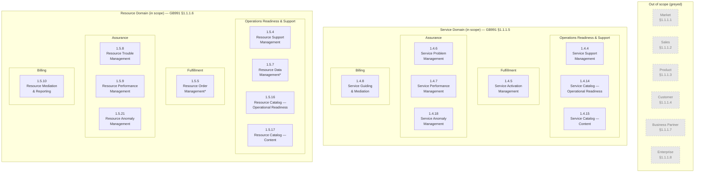
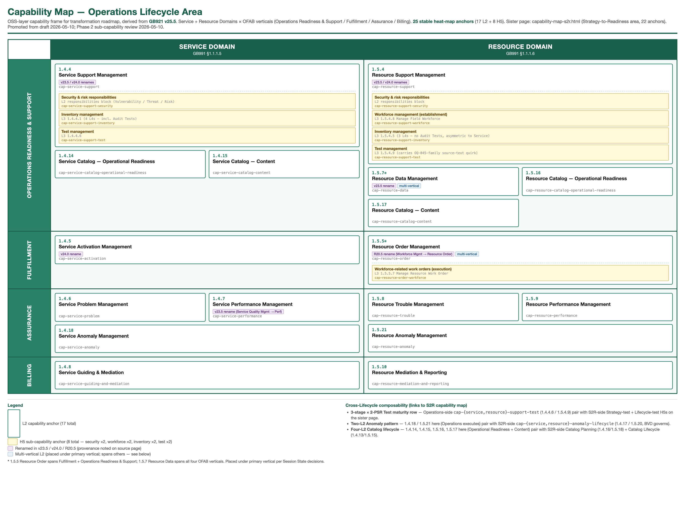

# Capability Map — OSS Layer, Service & Resource Domains

> **Derivative page.** This view synthesises content from authoritative wiki pages.
> It does not add new TMF facts. For normative claims, follow the links to source pages.
>
> **Derivation status — not a TMF-canonical map.** GB991 §1.2 (Business Capability Map)
> was marked **FUTURE WORK** in the TMF source — see [[wiki/open-questions#OQ-005]].
> There is no TMF-canonical operational capability map. What follows is **one defensible
> derivation** from in-scope eTOM L2 content (GB921 v25.5), organised on the PSR
> principle. Use it as a frame, not as authority.
>
> **Scope of this view.** OSS-layer practitioner cross-cut: Service Domain and Resource
> Domain only. The corpus's other ingested operational content (Product Domain L2s) is
> preserved on its source pages but appears here only as a greyed L1 frame element.

## Session State

> _Authoritative resume context for this view. Updated on every state transition. A
> fresh Claude session reads this callout end-to-end before doing anything else._

- **Last activity:** 2026-05-12 — **PHASE 3 ENTIRELY CLOSED — sub-capability review complete.** Companion-page [[wiki/views/capability-map-s2r]] reached final form: 16 L2s + 6 H5 anchors. **6 new H5 anchors on the S2R page** completed v25.5's **3-stage × 2-PSR Test maturity row** (Strategy / Lifecycle / Operations × Service / Resource = 6 cells) plus **PSR-paired Specification end-of-life** anchors (Service narrative-only / Resource 4 L4s). **Cross-anchor wikilinks added to this page's existing test H5s** (`cap-service-support-test` and `cap-resource-support-test`) so the cross-Lifecycle Test row is fully connected from any entry point — only structural change to this page since Phase 2. Sister-page Session State carries the canonical Phase 3 closure context. Final corpus stable-anchor inventory: **47 anchors — 25 on this page (17 L2 + 8 H5) + 22 on the S2R page (16 L2 + 6 H5)**.
- **Companion view:** [[wiki/views/capability-map-s2r]] — Strategy-to-Readiness Lifecycle Area capabilities. **16 L2s + 6 H5 sub-capabilities (Test ×4 + Exit ×2) — Phase 3 CLOSED 2026-05-12.** Strategy (2) + Capability Management (8) + Business Value Development (6) verticals all complete. Both pages share L1 Frame and `cap-<layer>-<kebab>` anchor convention. The S2R page's `pending` Mermaid style class is now empty — no remaining pending nodes.
- **Batching choice:** Thematic across PSR (Service ↔ Resource pairs per theme), not by domain. Surfaces cross-PSR rollup decisions immediately so each pattern is debated once.
- **Refined goal (per 2026-05-09 user direction):** Capability map for **gap-analysis heat-map overlay** and **change roadmap**. Visualises where the user's current monolithic, code-driven BSS/OSS stack diverges from a PSR-driven TMF/eTOM target architecture (Nokia OSS). Deliberately surfaces TMF distinctions that legacy systems typically conflate — e.g. Service Problem vs Resource Trouble, Service Catalog vs Service Activation, Service Performance vs Service Anomaly vs Service Problem, ticketing-as-fault vs the three-way TMF assurance split.
- **Framing decisions settled (locked — do not relitigate):**
    1. **Output format** — single view page (this file).
    2. **Naming** — hybrid: derived capability label as **H4** (under OFAB-vertical H3) with verbatim eTOM L2 name and ID immediately below. Verbatim discipline preserved per CLAUDE.md §10.3; abstraction lives in the H4 label only. eTOM-aligned phrasing per user direction (label tracks the eTOM L2 wording for traceability rather than business-strategy vocabulary).
    3. **Cross-cutting capabilities** — twice in domain-specific form (e.g. Service Catalog Content + Resource Catalog Content as siblings). Not one capability with two PSR specialisations. PSR alignment is load-bearing per CLAUDE.md §3.
    4. **Anchor IDs** — stable, format `cap-<layer>-<kebab-name>` (e.g. `cap-service-anomaly`, `cap-resource-trouble`). Used by user-private overlay files in `project/` to wikilink the capability map.
    5. **Trilateral inline** — process-only. ODA/SID reachable via the L2 page wikilinks one click away; not duplicated here.
- **L1 frame decision:** GB991 §1.1.1 horizontal domains, business-area subset (8 of 11). In scope for L2 decomposition: **Service**, **Resource**. Greyed (out of scope; contextual frame only): Market, Sales, Product, Customer, Business Partner, Enterprise. Non-business GB991 domains (Shared, Patterns, Integration) omitted from this view as not BPF/operations-relevant per their own GB991 definitions.
- **L2 organisation within in-scope domains:** Grouped by OFAB vertical — Operations Readiness & Support → Fulfillment → Assurance → Billing. Sourced from `_in_scope_l2_digest.md` Vertical column (GB921 v25.5). Cross-vertical L2s (Resource Data spans 4; Resource Order spans 2) live under their primary vertical with a footnote.
- **Per-capability content (when populated):** capability label (H4) + stable anchor; verbatim eTOM L2 name and ID + OFAB vertical (italic line); scope (verbatim or near-verbatim from L2 page Overview); TMF distinction notes where corpus supports a meaningful boundary call-out; source-page wikilink.
- **Visualisation:** Mermaid `flowchart` diagram in `## L2 Capability Frame Diagram` between L1 Frame and Service Domain sections; shows all 17 in-scope L2s grouped by L1 + OFAB plus the 6 greyed L1 domains. Frame is fixed at framing-settlement time; capability content fills in batch by batch but the diagram doesn't change. Renders inline in Obsidian and any Mermaid-aware viewer.
- **Heat-map / overlay model:** Capability map stays pure TMF-derivative. Current-state status, Nokia mapping notes, and gap analysis live entirely in `project/` (security boundary per CLAUDE.md §10.4). The user's `project/` overlay file wikilinks the capability map's stable anchors. Claude does not read `project/` — ever.
- **Batches:**
    - **DONE:**
        1. **Catalog** (2026-05-09) — 4 capabilities, all HIGH: `cap-service-catalog-operational-readiness`, `cap-service-catalog-content`, `cap-resource-catalog-operational-readiness`, `cap-resource-catalog-content`.
        2. **Anomaly** (2026-05-10) — 2 capabilities, both HIGH: `cap-service-anomaly`, `cap-resource-anomaly`. OQ-045 filed for 1.5.21 source-text quirk.
        3. **Performance** (2026-05-10) — 2 capabilities, both HIGH: `cap-service-performance`, `cap-resource-performance`. v23.5 Service Quality → Service Performance rename surfaced as italic provenance line on 1.4.7; verbatim "Service Quality Management" preserved in 1.5.9 Scope quote with disambiguation callout.
        4. **Problem / Trouble** (2026-05-10) — 2 capabilities, both HIGH: `cap-service-problem`, `cap-resource-trouble`. TMF naming asymmetry preserved per eTOM-aligned framing; Customer-Domain Problem Handling boundary called out on Service side; Resource Trouble convergence-point input flows (alarms / performance / service problems) called out on Resource side. **Three-way Assurance triad now structurally complete** under both Service and Resource sections.
        5. **Support** (2026-05-10) — 2 capabilities + 2 H5 security sub-capabilities, all HIGH: `cap-service-support`, `cap-resource-support`, `cap-service-support-security`, `cap-resource-support-security`. Two-step rename history surfaced as italic provenance lines on both. Workforce-as-Resource-Support-responsibility distinction surfaced (closes the L1-frame Workforce Management question). Multi-ODA ownership (OQ-044 "split into 2" / Production + Intelligence Management) surfaced with explicit Intelligence-Management-share distinction (trend analysis & forecasting at the infrastructure layer) vs Performance L2s (KPI / objective / metrics tracking).
        6. **Activation / Order / Data / Mediation** (2026-05-10) — 5 capabilities (`cap-service-activation`, `cap-service-guiding-and-mediation`, `cap-resource-order`, `cap-resource-data`, `cap-resource-mediation-and-reporting`) + 1 fresh H5 (`cap-resource-order-workforce`) + 1 retroactive H5 (`cap-resource-support-workforce` added to Batch-5 Resource Support entry), all HIGH. Three more rename callouts (1.4.5 v24.0 Service Configuration & Activation → Service Activation Management; 1.5.7 v23.5 Resource Data Collection & Distribution → Resource Data Management; cross-version 1.5.5 R20.5 Workforce Management → v25.5 Resource Order Management). Naming-similarity disambiguation 1.4.8 ↔ 1.5.10 (Billing-vertical, both mediation, different event scope). Workforce surfaced via dedicated L3 1.5.4.8 (establishment side) + L3 1.5.5.7 (execution side) — TMF-aligned heat-map fidelity. Capability map structurally complete after this batch.
        - **Phase 2 — L3 Review Additions** (2026-05-10) — 4 new H5 sub-capabilities added per the (renamed) **L3-derived sub-capability convention**: `cap-service-support-inventory` (L3 1.4.4.1 with 4 L4s), `cap-resource-support-inventory` (L3 1.5.4.5 with 3 L4s — asymmetric to Service: no Audit Tests L4), `cap-service-support-test` (L3 1.4.4.6, no L4s in source), `cap-resource-support-test` (L3 1.5.4.9, no L4s in source; carries a source-text quirk parenthetical akin to OQ-045 — *"Product and Service Manage Resource Test process"* where intent is *"Product and Service Test Management processes"*). Number Portability (1.5.4.7) considered and skipped at user direction (single-PSR-side, telecom-specific; not in three-team interview scope). Phase 1 review (Strategy / Capability verticals out of scope per CLAUDE.md §3) confirmed and recorded as a deferred decision pending user prompt for scope expansion.
    - **IN-PROGRESS:** _(none)_
    - **PENDING:** _(none — capability map structurally complete with all approved Phase 2 additions)_
- **Pending decisions:** _(none — both prior decisions actioned 2026-05-10: file promoted to canonical name `wiki/views/capability-map.md`; S2R-vertical scope expansion moved into active Phase 3 scoping. Phase 3 will surface its own decisions for user review before any ingest.)_
- **Provenance-line convention (settled at Batch 3):** When a TMF L2 has a documented version-rename, surface it as a second italic line *immediately above* the Scope block (under the `eTOM L2:` italic line). Reader hits it before reading the verbatim text, which prevents confusion when older / sibling source texts still use the prior name. Apply to any future capability where the source flags a rename. (User-approved 2026-05-10.)
- **Naming-asymmetry convention (settled at Batch 4):** Where TMF-source uses different terms for PSR analogs (e.g. Service "Problem" vs Resource "Trouble"), preserve the asymmetry in capability labels per eTOM-aligned framing decision #2. Surface the asymmetry as a TMF distinction call-out in both entries so a reader hitting either side sees the explanation. (User-approved 2026-05-10.)
- **Security-H5 convention (settled at Batch 5):** Where a TMF L2 carries an explicit list of security/risk responsibilities (e.g. Vulnerability Management, Threat Assessments, Risk Assessments, Risk Mitigation, Secure Configuration Activities — currently observed in both Support L2s 1.4.4 and 1.5.4), promote those responsibilities to a dedicated H5 sub-section *Security & risk responsibilities (heat-map sub-capability)* with a stable sub-anchor `cap-<layer>-<l2>-security`. Heat-map overlay can mark security maturity independently of the broader L2 capability cell. Verbatim source bullets are duplicated in the H5 (the capability page is the heat-map canvas; the L2 page remains the authoritative source). (User-approved 2026-05-10.)
- **TMF-pure mental-category convention (settled at Batch 5):** Practitioner mental categories for "support types" (e.g. infrastructure / customer-services / intelligence) are not synthesised into the wiki capability map. Mental-category mapping lives in the user's `project/` overlay file, which wikilinks the capability map's stable anchors. The wiki capability map stays TMF-source-pure; mental-category groupings are organisation-specific and belong outside the corpus per CLAUDE.md §10.4. (User-approved 2026-05-10.)
- **L3-derived sub-capability convention (originally "Workforce-H5 convention", renamed at Phase 2 — Batch 6 + L3 review):** Where a TMF L2 carries a dedicated L3 process whose scope is a recognised practitioner concern with substantive source treatment, promote it as a heat-map sub-capability via H5 with stable sub-anchor `cap-<l2-anchor>-<concern>`. Stricter test than the security-H5 convention (which was justified by a multi-bullet block within an L2's responsibility list, with no dedicated L3): an L3-derived H5 requires a *named L3 process* with substantive scope. Apply going forward only when both criteria hold (recognised practitioner concern + dedicated L3 backing). **Observed instances:** workforce (1.5.4.8 Manage Field Workforce; 1.5.5.7 Manage Resource Work Order); inventory (1.4.4.1 Manage Service Inventory; 1.5.4.5 Manage Resource Inventory); test (1.4.4.6 Manage Service Test; 1.5.4.9 Manage Resource Test). Number Portability (1.5.4.7) considered but rejected during the L3 review — single-PSR-side, domain-specific (telecom-regulatory), not in user's interview scope. (User-approved 2026-05-10 across two phases.)
- **Next action:** Phase 3 — scope the S2R-lifecycle Strategy & Capability verticals expansion. Identify what GB921 L2s sit under Strategy Management / Capability Management / Business Value Development verticals (the three S2R-area lifecycle stages plus the S2R-side of ORS); identify related SID ABEs that would need ingest; specify the CLAUDE.md §3 amendment; specify L1-frame and Mermaid-diagram extensions; estimate effort. **Scoping output is a separate artifact** (planned `wiki/views/capability-map-s2r-scope-plan.md` or similar — naming to be confirmed during scoping). No ingest happens during scoping — that's a downstream user decision. Heat-map overlay work in `project/` remains the user's parallel-track activity.

## Purpose

This view is a derived capability map intended as a **gap-analysis frame**: a stable set of TMF-aligned operational capabilities, organised on the PSR principle, against which a practitioner can overlay current-state status (present / partial / different / missing) maintained separately in user-private notes.

The map's value comes from making PSR-driven boundaries between operational concerns visible — particularly the boundaries that monolithic, code-driven BSS/OSS implementations typically conflate. It is intended to support a roadmap of change toward a TMF-aligned target architecture (e.g. Nokia OSS), and is designed to be visually overlaid with a heat map of gap status maintained outside this corpus.

The anchor IDs on each capability (`cap-<layer>-<kebab-name>`) are stable so user-private overlay files (in the project's `project/` area, which Claude does not read) can wikilink-reference them without breaking when the map evolves.

## L1 Frame

GB991 §1.1.1 defines eleven horizontal domains. For an operations-area capability map, the eight business-area domains form the L1 frame. Two are in scope for full L2 decomposition; six are present as greyed context — they bound what is intentionally NOT in this view's scope, with one-click links out to the foundation domain definitions for reference.

| Domain | Status | Definition |
|---|---|---|
| Market | _Greyed — out of scope for this view_ | [[wiki/foundations/domains#Market Domain]] (GB991 §1.1.1.1) |
| Sales | _Greyed — out of scope for this view_ | [[wiki/foundations/domains#Sales Domain]] (GB991 §1.1.1.2) |
| Product | _Greyed — out of scope for this view_ | [[wiki/foundations/domains#Product Domain]] (GB991 §1.1.1.3). Note: corpus contains 12 in-scope Product Domain L2 pages from GB921; they are preserved on their source pages but not surfaced as capabilities in this view. |
| Customer | _Greyed — out of scope for this view_ | [[wiki/foundations/domains#Customer Domain]] (GB991 §1.1.1.4) |
| **Service** | **In scope — L2 decomposition below** | [[wiki/foundations/domains#Service Domain]] (GB991 §1.1.1.5) |
| **Resource** | **In scope — L2 decomposition below** | [[wiki/foundations/domains#Resource Domain]] (GB991 §1.1.1.6) |
| Business Partner | _Greyed — out of scope for this view_ | [[wiki/foundations/domains#Business Partner Domain]] (GB991 §1.1.1.7). Includes Suppliers and Partners. |
| Enterprise | _Greyed — out of scope for this view_ | [[wiki/foundations/domains#Enterprise Domain]] (GB991 §1.1.1.8). Corporate / Finance / HR support functions. |

Three further GB991 horizontal domains are omitted from this view by their own GB991 definitions: **Shared** (§1.1.1.9 — *"specialized for use in the Information Framework (SID) and the Functional Framework"*; not a BPF/operations domain), **Patterns** (§1.1.1.10 — SID-only abstract patterns), **Integration** (§1.1.1.11 — business-agnostic infrastructure / middleware).

## L2 Capability Frame Diagram

The frame below shows all 17 in-scope L2 capabilities grouped by L1 horizontal domain and OFAB vertical, plus the six greyed L1 domains that bound this view's scope. Capability nodes carry their eTOM L2 ID; greyed L1 domains carry the GB991 §1.1.1 reference. The diagram is the same canvas a heat-map overlay would colour — capability content (the H4 sections that follow) fills in batch by batch, but this frame is fixed.

`*` 1.5.5 Resource Order spans Fulfillment + Operations Readiness & Support; 1.5.7 Resource Data spans all four OFAB verticals. Both placed under primary vertical per Session State decisions; reconfirm during Batch 6.

## Visual exports

A boxes-in-boxes treemap render of this capability map for printing, embedding, and stakeholder presentations. The render shows the same 17 L2 + 8 H5 anchors as the Mermaid frame above, but with H5 sub-capabilities visually nested inside their parent L2 boxes — closer to the canonical TMF / business-architecture capability-map visual style than the Mermaid flowchart frame. Resource Support Management's 4 H5 anchors (security + workforce + inventory + test) — the densest sub-capability cluster in the corpus — render cleanly as nested cells.

Files in [`diagrams/`](diagrams/) (regenerable via `diagrams/render.sh`):

- **[capability-map.pdf](diagrams/capability-map.pdf)** — A3 landscape, print-quality
- **[capability-map.png](diagrams/capability-map.png)** — 1800×1400 @ 2× DPI, for screen / embedding (rendered above)
- **[capability-map.html](diagrams/capability-map.html)** — source HTML; edit + re-render to iterate

**Combined view** — both Lifecycle Areas (this page + sister-page S2R area in one diagram, all 47 anchors visible together; useful when you want to see cross-Lifecycle composability — Test row / Anomaly pair / Catalog 4-L2 — in a single glance):

- [capability-map-combined.pdf](diagrams/capability-map-combined.pdf) — A2 landscape
- [capability-map-combined.png](diagrams/capability-map-combined.png)
- [capability-map-combined.html](diagrams/capability-map-combined.html)

**S2R-area sister render** — [capability-map-s2r.pdf](diagrams/capability-map-s2r.pdf) · [capability-map-s2r.png](diagrams/capability-map-s2r.png) · [capability-map-s2r.html](diagrams/capability-map-s2r.html).

The diagram renders are derivative artefacts of this view page; they do not add new TMF facts. For normative claims, follow the wikilinks from individual capability anchors (below) to source pages.

## Service Domain — L2 Capabilities (in scope)

_Awaiting batch decisions. Skeleton structure shown; capability content populated batch-by-batch with user sign-off._

### Operations Readiness & Support

#### Service Support

*eTOM L2: 1.4.4 Service Support Management — OFAB vertical: Operations Readiness & Support*
*Rename history (per GB921 v25.5 source notes): named "Service Readiness & Support" pre-v23.5; "Service Support Readiness" v23.5–v23.x; "Service Support Management" from v24.0 onward. Older documents may reference any of the three.*

**Scope.** Service Support Management processes manage service infrastructure, ensuring that the appropriate service capacity is available and ready to support the SM&O Fulfillment, Assurance and Billing processes in instantiating and managing service instances, and for monitoring and reporting on the capabilities and costs of the individual SM&O FAB processes.

The responsibilities of these processes include, but are not limited to:
- Supporting the operational introduction of new and/or modified service infrastructure;
- Managing and ensuring the ongoing quality of the Service Inventory;
- Applying service capacity rules from Infrastructure Lifecycle Management processes;
- Analyzing availability and quality over time on service infrastructure and service instances, including trend analysis and forecasting;
- Ensuring the operational capability of the SM&O processes;
- Maintaining rating and tariff information for service infrastructure and service instances;
- Conducting Vulnerability Management;
- Conducting Threat Assessments;
- Conducting Risk Assessments;
- Conducting Risk Mitigation;
- Conducting Secure Configuration Activities.

— GB921 v25.5

##### Security & risk responsibilities (heat-map sub-capability)

GB921 v25.5 explicitly lists these as Service Support Management responsibilities:
- Conducting Vulnerability Management
- Conducting Threat Assessments
- Conducting Risk Assessments
- Conducting Risk Mitigation
- Conducting Secure Configuration Activities

**TMF v25.5 OFAB does not house a separate Security Management L2.** These responsibilities live here, at the infrastructure-readiness layer of each PSR side. The same set appears verbatim under [[#cap-resource-support-security|Resource Support — Security & risk]] (1.5.4).

Stable sub-anchor `cap-service-support-security` for heat-map overlay — security maturity can be marked independently of broader Service Support coverage.

##### Inventory management (heat-map sub-capability)

GB921 v25.5 carries a dedicated L3 process for service inventory management under this L2: **1.4.4.1 Manage Service Inventory** —

> *"The responsibilities of the Manage Service Inventory processes are twofold — establish, manage and administer the enterprise's service inventory, as embodied in the Service Inventory Database, and monitor and report on the usage and access to the service inventory, and the quality of the data maintained in it. The service inventory maintains records of all service infrastructure and service instance configuration, version, and status details. It also records test and performance results and any other service-related information, required to support SM&O and other processes. The service inventory is also responsible for maintaining the association between customer purchased product offering instances and service instances, created as a result of the Service Configuration & Activation processes."* — GB921 v25.5, 1.4.4.1

L4 sub-processes (verbatim from GB921 v25.5 1.4.4.1):
- **1.4.4.1.1** *Manage Service Inventory Database and Processes* — establishing, managing and administering the enterprise's service inventory.
- **1.4.4.1.2** *Perform Service Inventory Audit Tests* — performing audit if inventory repository accurately captures and records all identified service infrastructure and service instance details.
- **1.4.4.1.3** *Track and Monitor Service Inventory Capabilities* — monitoring and reporting on the usage and access to the service inventory, and the quality of the data maintained in it.
- **1.4.4.1.4** *Identify Service Inventory Issues and Provide Reports and Warnings* — managing and identifying any service Inventory Repository issues and providing warnings.

**Service Inventory Database — single source of truth for service-side state.** The L3 establishes a centralised service-inventory repository covering: service infrastructure + service-instance configuration / version / status; test and performance results; product-offering ↔ service-instance associations. For heat-map overlay, this surfaces inventory tooling maturity — database existence, data quality, audit cadence, repository facilities — independently of the broader [[#cap-service-support|Service Support]] cell.

Stable sub-anchor `cap-service-support-inventory` for heat-map overlay.

##### Test management (heat-map sub-capability)

GB921 v25.5 carries a dedicated L3 process for service test management under this L2: **1.4.4.6 Manage Service Test** —

> *"Manage Service Test process manages the end-to-end execution of a test or test scenario for services not specific to a customer. Tests can be manual or automated. Service Test Management processes rely on Product and Resource Test Management processes due to dependencies between product tests and resource tests."* — GB921 v25.5, 1.4.4.6

Service Test Management includes (verbatim, GB921 v25.5 1.4.4.6):
- Identification of service tests needed according to fulfillment and assurance issues
- Triggering of service tests in manual or automated mode
- Execution of service tests
- Verification of test authorization (role and context) and quota management
- Identification and prioritization of tests
- Setting up the test context and configuration
- Triggering appropriate product and resource Tests
- Tests can be on-demand or planned according to specific needs
- Enrichment with product and resource tests results based on applicable service test rules
- Reporting of test results

(No L4 sub-processes documented for 1.4.4.6 in GB921 v25.5 Excel master.)

**Cross-PSR test orchestration.** Source explicitly establishes that Service Test Management *"relies on Product and Resource Test Management processes due to dependencies between product tests and resource tests"* — Service Test sits at the cross-PSR test orchestration point. Heat-map readers should expect this cell's maturity to depend on [[#cap-resource-support-test|Resource Test]] (1.5.4.9) maturity. Note: a related per-activation L3 — **1.4.5.5 Test Service End-to-End** — sits inside [[#cap-service-activation|Service Activation]] (1.4.5) and exercises this test-orchestration capability per provisioning event rather than as an ongoing test-management facility.

**Cross-Lifecycle Test maturity row (Phase 3 closing review, 2026-05-12).** This Operations-level test-execution anchor is the rightmost cell in v25.5's **3-stage × 2-PSR Test maturity row**. The other two Service-side cells live on the [[wiki/views/capability-map-s2r|S2R companion view page]]:

- **Strategy-level** (S2R / Strategy Management) — [[wiki/views/capability-map-s2r#cap-service-strategy-test|`cap-service-strategy-test`]] (L3s 1.4.1.8 Service Test Strategy + 1.4.1.9 Analyze Service Test Quality) — defines test types per business activity; analyses test quality offline.
- **Lifecycle-level** (S2R / Business Value Development) — [[wiki/views/capability-map-s2r#cap-service-specification-lifecycle-test|`cap-service-specification-lifecycle-test`]] (L3 1.4.3.8 Service Specification Test Development & Retirement) — owns the Service Test catalogue (roles, methods, rules, thresholds, lower-level Resource Test composition).
- **Operations-level (this anchor)** — execution of test or test scenario; orchestrates Product + Resource Test composition.

Heat-map overlay can mark each Lifecycle-stage cell independently; practitioner orgs typically have very different maturity profiles across the three stages.

Stable sub-anchor `cap-service-support-test` for heat-map overlay.

**TMF distinctions.**
- vs [[#cap-service-catalog-operational-readiness|Service Catalog — Operational Readiness]] (1.4.14): both ORS, different scopes. Service Support manages the broader SM&O infrastructure that supports all FAB processes; Service Catalog Operational Readiness is the specific machinery for catalog operations.
- vs [[#cap-service-activation|Service Activation]] (1.4.5): Support is ORS — keeping infrastructure ready for FAB processes; Activation is Fulfillment — provisioning specific service instances against customer requests.
- vs [[#cap-resource-support|Resource Support]] (1.5.4): PSR boundary. Service Support manages *service infrastructure* (Service Inventory; service-instance capacity); Resource Support manages *resource infrastructure* (application, computing, network; Resource Inventory). Parallel responsibility shapes; same security/risk block (see H5 sub-section above).
- **Security & risk responsibilities** — surfaced as heat-map sub-capability, see [[#cap-service-support-security|Security & risk responsibilities]] H5 above.
- **Inventory management** — surfaced as heat-map sub-capability, see [[#cap-service-support-inventory|Inventory management]] H5 above (L3 1.4.4.1).
- **Test management** — surfaced as heat-map sub-capability, see [[#cap-service-support-test|Test management]] H5 above (L3 1.4.4.6).
- **Multi-ODA ownership** ([[wiki/open-questions#OQ-044]]). GB1022 §4.6.1 flags Service Support Management as "split into 2" — jointly owned by Production + Intelligence Management ODA functional blocks. The same applies to the Support trio (1.2.4 Product Support — out of view scope — plus 1.5.4 Resource Support). **Trend analysis & forecasting at the infrastructure layer is the Intelligence Management share of this L2** — distinct from [[#cap-service-performance|Service Performance]] (1.4.7) which owns KPI / objective tracking. Trilateral content stays out of this view per framing decision #5; flagged here as practitioner context for current-state mapping.

**Source page.** [[wiki/etom/service-domain/service-support-management]]

#### Service Catalog — Operational Readiness

*eTOM L2: 1.4.14 Service Catalog Operational Readiness Management — OFAB vertical: Operations Readiness & Support*

**Scope.** Service Catalog Operational Readiness Management business process establishes and administers the support needed to operationalize Service catalogs for ongoing day-to-day business needs. These business activities implement the Service Catalog through Release and Deploy business activities. — GB921 v25.5

**TMF distinctions.**
- vs [[#cap-service-catalog-content|Service Catalog — Content]] (1.4.15): operational readiness is the *machinery* (release, deploy, day-to-day support) keeping the catalog running as a system; content covers *what is in* the catalog. Both can fail independently — a deployed catalog with no curated content; or curated content with no operational support.
- vs [[wiki/etom/service-domain/service-activation-management|Service Activation Management]] (1.4.5): catalog defines *what services can exist* and how to administer that definition; activation provisions *a specific service instance* against a customer request.

**Source page.** [[wiki/etom/service-domain/service-catalog-operational-readiness-management]]

#### Service Catalog — Content

*eTOM L2: 1.4.15 Service Catalog Content Management — OFAB vertical: Operations Readiness & Support*

**Scope.** Service Catalog Content Management business process define and provide the business activities that support the day-to-day operations of Service Catalogs in order to realize the business operations goals. Service Catalog Content Management business processes include administering the Service Catalog instance in production, maintaining catalog entries, assuring catalogs, managing catalog access, managing entry lifecycle through versioning, handling catalog entity entry and changes, supporting distribution of catalogs as needed, and supporting user-facing activities. — GB921 v25.5

**TMF distinctions.**
- vs [[#cap-service-catalog-operational-readiness|Service Catalog — Operational Readiness]] (1.4.14): content is the catalog's *substance* (service specifications, offerings, attributes, versions, lifecycle); operational readiness is the machinery keeping the catalog running as a system. A code-driven environment can have informal content (specifications living in code) without a Catalog Content capability — and inversely a deployed catalog product may have operational readiness with no curated content.
- vs [[wiki/etom/service-domain/service-activation-management|Service Activation Management]] (1.4.5): content defines *what services can exist*; activation provisions *a specific service instance* against a customer request. The TMF separation lets a service definition evolve (catalog change) independently of running service instances (activation).

**Source page.** [[wiki/etom/service-domain/service-catalog-content-management]]

### Fulfillment

#### Service Activation

*eTOM L2: 1.4.5 Service Activation Management — OFAB vertical: Fulfillment*
*Rename history (per GB921 v25.5 source note): renamed in v24.0 from "Service Configuration & Activation". Configuration responsibilities are retained in scope (the rename dropped the word, not the work — see Scope responsibility list).*

**Scope.** Service Activation Management processes encompass allocation, implementation, configuration, activation and testing of specific services to meet customer requirements, or in response to requests from other processes to alleviate specific service capacity shortfalls, availability concerns or failure conditions. Where included in the service provider offering, these processes extend to cover customer premises equipment.

Responsibilities of the Service Configuration & Activation processes include, but are not limited to:
- Verifying whether specific service designs sought by customers are feasible as part of pre-order feasibility checks;
- Allocating the appropriate specific service parameters to support service orders or requests from other processes;
- Reserving specific service parameters (if required by the business rules) for a given period of time until the initiating customer order is confirmed, or until the reservation period expires (if applicable);
- Implementing, configuring and activating specific services, as appropriate;
- Testing the specific services to ensure the service is working correctly;
- Recovery of specific services;
- Updating of the Service Inventory Database to reflect that the specific service has been allocated, modified or recovered;
- Assigning and tracking service provisioning activities;
- Managing service provisioning jeopardy conditions;
- Reporting progress on service orders to other processes.

— GB921 v25.5

> The responsibilities header above reads *"Responsibilities of the Service Configuration & Activation processes"* — the v24.0 rename to "Service Activation Management" was applied to the L2 name and process ID heading but not propagated into the responsibilities preamble. Same L2; verbatim source preserved.

**TMF distinctions.**
- vs [[#cap-service-catalog-content|Service Catalog — Content]] (1.4.15) and [[#cap-service-catalog-operational-readiness|Service Catalog — Operational Readiness]] (1.4.14): catalog defines *what services can exist* and operates the catalog system; activation provisions *a specific service instance* against a customer request. Different lifecycle stages — catalog change is one cadence, instance activation is another.
- vs [[#cap-service-support|Service Support]] (1.4.4): Support is ORS — keeping infrastructure ready for FAB; Activation is Fulfillment — provisioning specific service instances. Support's "Service Inventory" ongoing-quality responsibility complements Activation's "Updating of the Service Inventory Database" per-order responsibility.
- vs [[#cap-resource-order|Resource Order]] (1.5.5): PSR boundary. Service Activation provisions *service instances* to customers; Resource Order orders, schedules, and allocates *resources* (materials, equipment, personnel) that may be required to support those instances. A service activation may consume resource orders.
- **Configuration retained.** Despite the v24.0 rename, configuration responsibilities are still in scope (*"Implementing, configuring and activating specific services"*). Reading the L2 name as "no longer about configuration" is wrong.

**Source page.** [[wiki/etom/service-domain/service-activation-management]]

### Assurance

#### Service Problem

*eTOM L2: 1.4.6 Service Problem Management — OFAB vertical: Assurance*

**Scope.** Service Problem Management processes are responsible for the management of problems associated with specific services. The objective of these processes is to respond immediately to reported service problems or failures in order to minimize their effects on customers, and to invoke the restoration of the service, or provide an alternate service as soon as possible.

Responsibilities of the Service Problem Management processes include, but are not limited to:
- Detecting, analyzing, managing and reporting on service alarm event notifications;
- Initiating and managing service trouble reports;
- Performing service problem localization analysis;
- Correcting and resolving service problems;
- Reporting progress on service trouble reports to other processes;
- Assigning & tracking service problem testing and recovery activities;
- Managing service problem jeopardy conditions.

Service Problem Management processes perform analysis, decide on the appropriate actions/responses and carry them out with the intent of restoring normal operation on specific services. — GB921 v25.5

**TMF distinctions.**
- vs [[#cap-service-anomaly|Service Anomaly]] (1.4.18): Anomaly is pre-Problem (predict / detect / mitigate before it becomes a known issue); Problem is *known-issue restoration*. Source-grounded boundary on the Anomaly side: *"Service Anomaly Management is different from Service Problem Management as the later addresses known issues, faults or problems."*
- vs [[#cap-service-performance|Service Performance]] (1.4.7): Performance is the *measurement and objectives* layer (KPIs, targets, trend analysis); Problem is the *known-fault restoration* layer. A missed performance objective can become a Service Problem; the lifecycle stages are distinct.
- vs [[#cap-resource-trouble|Resource Trouble]] (1.5.8): **PSR boundary, source-cited bidirectional coordination.** GB921 1.5.8 Overview: *"Resource Trouble Management processes are responsible for informing Service Problem Management of any potential service problems. Where the original report arose as a result of service problems, the Resource Trouble Management processes may be coordinated by Service Problem Management processes."* Service Problem has the *customer-impact* view; Resource Trouble has the *infrastructure-fault* view; they coordinate. **TMF naming asymmetry:** Service-side uses "Problem"; Resource-side uses "Trouble"; same lifecycle role.
- vs Customer Domain Problem Handling (out of scope — greyed L1): 1.4.6 Overview references *"Problem Handling processes"* which sit in the Customer Domain (out of this view's scope). Service Problem *interacts with* Problem Handling but is distinct — Service Problem manages service-restoration; Problem Handling owns customer-facing case management.

**Source page.** [[wiki/etom/service-domain/service-problem-management]]

#### Service Performance

*eTOM L2: 1.4.7 Service Performance Management — OFAB vertical: Assurance*
*v23.5 rename: previously named "Service Quality Management" (per GB921 v25.5 source note on the 1.4.7 page). Older documents — and even some current-version L2 source texts (e.g. 1.5.9 Resource Performance Management) — still refer to "Service Quality Management"; same L2.*

**Scope.** Service Performance Management business process directs and controls activities that define Service Performance Objectives (e.g. Service Availability, Service Quality, Process efficiency, Service Reliability, etc.), sets performance goals & targets, track performance trends, monitor performance, analyze performance, control performance (optimize, troubleshoot), report or communicate performance, and manage consequences of service performance. Service Performance Management business process support the Enterprise Performance Management goals. These goals include quality, efficiency, reliability, availability, monetary (cost, profitability, etc.) mandates along with any productivity requirement of service delivery and service engagement by the organization. It includes identifying, establishing the applying the methodologies that define and manage service performance criteria to meet business objectives. — GB921 v25.5

**TMF distinctions.**
- vs [[#cap-service-anomaly|Service Anomaly]] (1.4.18): Performance defines and tracks Service Performance Objectives and the methodologies for managing them; Anomaly detects outlier events against known patterns. Distinct L2s in the same Assurance vertical.
- vs [[#cap-service-problem|Service Problem]] (1.4.6): Performance is the *measurement and objectives* layer (KPIs, trend analysis, optimisation, methodology); Problem is the *known-fault restoration* layer. Different lifecycle stages — Performance can identify a missed objective which then becomes a Service Problem to manage.
- vs [[#cap-resource-performance|Resource Performance]] (1.5.9): PSR boundary — Service Performance covers customer-facing service-layer KPIs (availability, quality, reliability of service offerings); Resource Performance covers infrastructure-layer KPIs. Boundary is explicit and bidirectional in the source: 1.5.9 establishes that resource performance violations may be passed to Service Performance (referenced in the source as "Service Quality Management"; see rename note above).

**Source page.** [[wiki/etom/service-domain/service-performance-management]]

#### Service Anomaly

*eTOM L2: 1.4.18 Service Anomaly Management — OFAB vertical: Assurance*

**Scope.** Service Anomaly Management business processes establish actions that predict and detect aberrations or outlier events/activities, assess them for their impact, mitigate them, and record them before they ever become Service Problem Management concerns. By establishing that an action or event is abnormal (based on known patterns), Service Anomaly Management helps to assess them through a set of activities that may triage, plan detailed assessment, classify them and provide mitigatory actions for them. Through Service Anomaly Management, assurance of Products, based on abnormal events or activities can be well categorized, prioritized and actioned on. — GB921 v25.5

**TMF distinctions.**
- vs [[#cap-service-problem|Service Problem]] (1.4.6): GB921 v25.5 states it directly — *"Service Anomaly Management is different from Service Problem Management as the later addresses known issues, faults or problems."* Anomaly is **pre-Problem** — predict / detect / mitigate abnormalities *before they become* known issues.
- vs [[#cap-service-performance|Service Performance]] (1.4.7): Performance directs Service Performance Objectives (availability, quality, reliability), sets goals, monitors trends, analyzes / controls performance. Anomaly detects outlier events against known patterns. Distinct L2s in the same Assurance vertical.
- vs [[#cap-resource-anomaly|Resource Anomaly]] (1.5.21): PSR boundary — Service Anomaly addresses customer-facing service-layer abnormalities; Resource Anomaly addresses infrastructure-layer abnormalities. Both feed pre-Problem / pre-Trouble assurance at their respective layers.

**Source page.** [[wiki/etom/service-domain/service-anomaly-management]]

### Billing

#### Service Guiding & Mediation

*eTOM L2: 1.4.8 Service Guiding & Mediation — OFAB vertical: Billing*

**Scope.** Service Guiding & Mediation processes manage usage events by correlating and formatting them into a useful format. These processes include guiding resource events to an appropriate service, mediation of these usage records, as well as de-duplication of usage records already processed. These processes provide information on customer-related and Service-related events to other process areas across assurance and billing. This includes reports on non-chargeable events and overcharged events and analysis of event records to identify fraud and prevent further occurrences.

In many cases, this process is performed by a resource such as a network element. — GB921 v25.5

**TMF distinctions.**
- vs [[#cap-resource-mediation-and-reporting|Resource Mediation & Reporting]] (1.5.10): **Naming similarity, PSR boundary.** Both Billing vertical, both involve mediation. 1.4.8 (this L2) handles *customer / service-related* usage events — guiding resource events to the appropriate service, mediating service usage records, identifying fraud and overcharges. 1.5.10 handles *resource* events — resource event correlation, billing event problem investigation. Both source texts also note these processes are *"often handled by appropriate network elements"* / *"performed by a resource such as a network element"* — same execution pattern.
- vs [[#cap-service-performance|Service Performance]] (1.4.7): Performance owns Service Performance Objectives — KPIs, targets, trend analysis, methodology. Service Guiding & Mediation manages *usage events* — different artifacts (events vs metrics) and different downstream consumers (assurance + billing for events; Enterprise Performance Management for metrics).
- **Resource event → Service routing.** Source: *"guiding resource events to an appropriate service"* — Service Guiding & Mediation is the upward routing point that takes raw resource-side events and attributes them to the correct service for billing/assurance purposes.

**Source page.** [[wiki/etom/service-domain/service-guiding-and-mediation]]

## Resource Domain — L2 Capabilities (in scope)

_Awaiting batch decisions. Skeleton structure shown; capability content populated batch-by-batch with user sign-off._

### Operations Readiness & Support

#### Resource Support

*eTOM L2: 1.5.4 Resource Support Management — OFAB vertical: Operations Readiness & Support*
*Rename history (per GB921 v25.5 source notes): named "Resource Readiness & Support" pre-v23.5; "Resource Support Readiness" v23.5–v23.x; "Resource Support Management" from v24.0 onward. Older documents may reference any of the three.*

**Scope.** Resource Support Management processes are responsible for managing resource infrastructure to ensure that appropriate application, computing and network resources are available and ready to support the Fulfillment, Assurance and Billing processes in instantiating and managing resource instances, and for monitoring and reporting on the capabilities and costs of the individual FAB processes.

Responsibilities of these processes include but are not limited to:
- Supporting the operational introduction of new and/or modified resource infrastructure and conducting operations readiness testing and acceptance;
- Managing planned outages;
- Managing and ensuring the ongoing quality of the Resource Inventory;
- Analyzing availability and performance over time on resources or groups of resources, including trend analysis and forecasting;
- Demand balancing in order to maintain resource capacity and performance;
- Performing pro-active maintenance and repair activities;
- Establishing and managing the workforce to support the eTOM processes;
- Managing spares, repairs, warehousing, transport and distribution of resources and consumable goods;
- Conducting Vulnerability Management;
- Conducting Threat Assessments;
- Conducting Risk Assessments;
- Conducting Risk Mitigation;
- Conducting Secure Configuration Activities.

— GB921 v25.5

##### Security & risk responsibilities (heat-map sub-capability)

GB921 v25.5 explicitly lists these as Resource Support Management responsibilities:
- Conducting Vulnerability Management
- Conducting Threat Assessments
- Conducting Risk Assessments
- Conducting Risk Mitigation
- Conducting Secure Configuration Activities

**TMF v25.5 OFAB does not house a separate Security Management L2.** These responsibilities live here, at the infrastructure-readiness layer of each PSR side. The same set appears verbatim under [[#cap-service-support-security|Service Support — Security & risk]] (1.4.4).

Stable sub-anchor `cap-resource-support-security` for heat-map overlay — security maturity can be marked independently of broader Resource Support coverage.

##### Inventory management (heat-map sub-capability)

GB921 v25.5 carries a dedicated L3 process for resource inventory management under this L2: **1.5.4.5 Manage Resource Inventory** —

> *"The responsibilities of the Manage Resource Inventory processes are twofold — establish, manage and administer the enterprise's resource inventory, as embodied in the Resource Inventory Database, and monitor and report on the usage and access to the resource inventory, and the quality of the data maintained in it. The resource inventory maintains records of all resource infrastructure and resource instance configuration, version, and status details. It also records test and performance results and any other resource-related information, required to support Resource-Ops and other processes. The resource inventory is also responsible for maintaining the association between service instances and resource instances, created as a result of the Resource Provisioning Management processes."* — GB921 v25.5, 1.5.4.5

L4 sub-processes (verbatim from GB921 v25.5 1.5.4.5):
- **1.5.4.5.1** *Manage Resource Inventory Database and Processes* — establishing, managing and administering the enterprise's resource inventory.
- **1.5.4.5.2** *Track and Monitor Resource Repository Capabilities* — monitoring and reporting on the usage and access to the resource inventory, and the quality of the data maintained in it.
- **1.5.4.5.3** *Identify Repository Issues and Provide Reports and Warnings* — managing and identifying any Inventory Repository issues and providing warnings.

**Resource Inventory Database — single source of truth for resource-side state.** Parallel structure to [[#cap-service-support-inventory|Service Inventory]]. Resource Inventory Database covers: resource infrastructure + resource-instance configuration / version / status; test and performance results; service-instance ↔ resource-instance associations. The Resource Inventory is the downstream side that the Service Inventory (1.4.4.1) cross-references via the service↔resource instance associations, making the two L3s a paired traceability backbone for the OSS layer.

Asymmetry note: Resource Inventory has 3 L4 sub-processes; Service Inventory has 4 — the Resource side does not carry an explicit "Audit Tests" L4 (1.4.4.1.2 has no resource-side analog in source).

Stable sub-anchor `cap-resource-support-inventory` for heat-map overlay.

##### Workforce management (heat-map sub-capability)

GB921 v25.5 carries a dedicated L3 process for workforce management under this L2: **1.5.4.8 Manage Field Workforce** —

> *"Managing the staff performing manual activities along with managing the actual activity being performed. This will include managing the workforce staff (directly or indirectly) employed by, or operating as part of, the enterprise (i.e. technicians, clerks, managers, etc.) that are assigned to, and perform the work specified. The staff directly managed by these processes include all employees, contractors and who are paid by the enterprise. The staff indirectly managed by these processes includes all employees, consultants and contractors paid by third parties who have commercial arrangements with the enterprise. In the cases where the third parties own and manage the service and/or resource infrastructure the Manage Field Workforce processes are responsible for requesting activities to be performed rather than directly assigning specific staff."* — GB921 v25.5, 1.5.4.8

Selected L4 sub-processes (verbatim from GB921 v25.5 1.5.4.8):
- **1.5.4.8.1** *Manage Field Workforce Catalogs* — performing the activities necessary to configure a variety of workforce management catalogs and settings required to assure that the assignable workforce is properly and efficiently utilized.
- **1.5.4.8.3** *Plan & Forecast Field Workforce* — responsible for planning and forecasting future workload and workforce availability demands and for making adjustments based on reports and forecasts.

(Full L4 list and source-reference detail on the L2 page: [[wiki/etom/resource-domain/resource-support-management#1.5.4.8 Manage Field Workforce|1.5.4.8 Manage Field Workforce]].)

Source note: *"the current focus of the Manage Field Workforce processes is field Staff and others managed through work orders, etc."*

**Establishment / planning side of the workforce concern.** This H5 surfaces the workforce-establishment, lifecycle, planning, system-integration, and registration work — the L3 1.5.4.8 scope. The execution side (per-order workforce work orders) lives in [[#cap-resource-order-workforce|Resource Order — Workforce-related work orders]] under 1.5.5.7.

Stable sub-anchor `cap-resource-support-workforce` for heat-map overlay — workforce-management establishment maturity can be marked independently of broader Resource Support coverage.

##### Test management (heat-map sub-capability)

GB921 v25.5 carries a dedicated L3 process for resource test management under this L2: **1.5.4.9 Manage Resource Test** —

> *"processes manage the end-to-end execution of a test or test scenario for resources not specific to a customer. Tests can be manual or automated. Resource Test Management processes rely on Product and Service Manage Resource Test process due to dependencies between product tests, service tests and resource tests."* — GB921 v25.5, 1.5.4.9

> **Source-text quirk** (cf. [[wiki/open-questions#OQ-045|OQ-045]] family — same shape of inconsistency). The phrase *"Product and Service Manage Resource Test process"* in source where the parallel Service Test L3 (1.4.4.6) reads *"Product and Resource Test Management processes"*. Intent is clearly *"Product and Service Test Management processes"* — same reciprocal language as 1.4.4.6, with the term not fully substituted on the resource side. Verbatim quote preserved above for source fidelity.

Resource Test Management includes (verbatim, GB921 v25.5 1.5.4.9):
- Identification of resource tests needed according to fulfillment and assurance issues
- Triggering of resource tests in manual or automated mode
- Execution of resource tests
- Verification of test authorization (role and context) and quota management
- Identification and prioritization of tests
- Setting up the test context and configuration
- Triggering appropriate product and service tests
- Tests can be on-demand or planned according to specific needs
- Enrichment with product and service tests results based on applicable resource test rules
- Reporting of test results

(No L4 sub-processes documented for 1.5.4.9 in GB921 v25.5 Excel master.)

**Resource-side test execution.** Parallel to [[#cap-service-support-test|Service Test]] (1.4.4.6) — both manage end-to-end test execution for their PSR side, with explicit cross-PSR dependencies. Resource Test produces the resource-test results that Service Tests (1.4.4.6) and Product Tests (out of view scope) consume.

**Cross-Lifecycle Test maturity row (Phase 3 closing review, 2026-05-12).** This Operations-level test-execution anchor is the rightmost cell in the Resource-side leg of v25.5's **3-stage × 2-PSR Test maturity row**. The other two Resource-side cells live on the [[wiki/views/capability-map-s2r|S2R companion view page]]:

- **Strategy-level** (S2R / Strategy Management) — [[wiki/views/capability-map-s2r#cap-resource-strategy-test|`cap-resource-strategy-test`]] (L3s 1.5.1.8 Resource Test Strategy + 1.5.1.9 Analyze Resource Test Quality).
- **Lifecycle-level** (S2R / Business Value Development) — [[wiki/views/capability-map-s2r#cap-resource-specification-lifecycle-test|`cap-resource-specification-lifecycle-test`]] (L3 1.5.3.8 Resource Specification Test Development & Retirement) — owns the Resource Test catalogue. **Resource is the bottom of the cross-PSR test composition stack** — Service Test catalogues compose against Resource Test; Resource Test catalogues do not compose lower.
- **Operations-level (this anchor)** — execution of test or test scenario; produces results that upstream Service / Product tests consume.

Heat-map overlay calibrates each Lifecycle-stage cell independently.

Stable sub-anchor `cap-resource-support-test` for heat-map overlay.

**TMF distinctions.**
- vs [[#cap-resource-catalog-operational-readiness|Resource Catalog — Operational Readiness]] (1.5.16): both ORS, different scopes. Resource Support manages the broader resource-infrastructure layer supporting all FAB processes; Resource Catalog Operational Readiness is the specific machinery for resource catalog operations.
- vs [[#cap-resource-order|Resource Order]] (1.5.5): Support is ORS — keeping resource infrastructure ready for FAB; Order is Fulfillment — capturing, scheduling, and allocating resource orders against requests.
- vs [[#cap-service-support|Service Support]] (1.4.4): PSR boundary. Resource Support manages *resource infrastructure* (application, computing, network resources; Resource Inventory); Service Support manages *service infrastructure*. Parallel responsibility shapes; same security/risk block (see H5 sub-section above).
- **Workforce as Resource Support responsibility, not separate L1 domain.** GB921 v25.5 lists *"Establishing and managing the workforce to support the eTOM processes"* as a Resource Support Management responsibility (bullet above) and carries a dedicated L3 process **1.5.4.8 Manage Field Workforce** for it. Workforce-management functions reside here — embedded in Resource Support at the operational-readiness layer — not as a top-level horizontal domain. (Earlier capability-map L1-frame discussion noted "Workforce Management" was sometimes proposed as an L1 sibling; this is the source position — it isn't.) **For heat-map overlay, the workforce-management establishment subset is surfaced as a separate H5 sub-capability — see [[#cap-resource-support-workforce|Workforce management]] above. The execution side (per-order work orders) lives in [[#cap-resource-order-workforce|Resource Order — Workforce-related work orders]] (1.5.5.7).**
- **Security & risk responsibilities** — surfaced as heat-map sub-capability, see [[#cap-resource-support-security|Security & risk responsibilities]] H5 above.
- **Inventory management** — surfaced as heat-map sub-capability, see [[#cap-resource-support-inventory|Inventory management]] H5 above (L3 1.5.4.5).
- **Test management** — surfaced as heat-map sub-capability, see [[#cap-resource-support-test|Test management]] H5 above (L3 1.5.4.9).
- **Multi-ODA ownership** ([[wiki/open-questions#OQ-044]]). GB1022 §4.6.1 flags Resource Support Management as "split into 2" — jointly owned by Production + Intelligence Management ODA functional blocks. The same applies to the Support trio (1.2.4 Product Support — out of view scope — plus 1.4.4 Service Support). **Trend analysis & forecasting at the infrastructure layer is the Intelligence Management share of this L2** — distinct from [[#cap-resource-performance|Resource Performance]] (1.5.9) which owns KPI / metrics tracking. Trilateral content stays out of this view per framing decision #5; flagged here as practitioner context for current-state mapping.

**Source page.** [[wiki/etom/resource-domain/resource-support-management]]

#### Resource Data

*eTOM L2: 1.5.7 Resource Data Management — OFAB verticals: all four (Operations Readiness & Support primary; also Fulfillment, Assurance, Billing). Placed under ORS as foundational data infrastructure enabling FAB processes.*
*Rename history (per GB921 v25.5 source note): renamed in v23.5 from "Resource Data Collection & Distribution". **Cascade implication:** GB921 v25.5 1.5.8 Resource Trouble and 1.5.9 Resource Performance source texts still reference the old name ("Resource Data Collection & Distribution") when describing input flows from this L2 — same pattern as the v23.5 Service Quality → Service Performance lineage on 1.4.7. When those entries cite "Resource Data Collection & Distribution", they mean this L2.*

**Scope.** Resource Data Management business process directs and controls the engineering, generation, integration auditing, distributing, analyzing, and visualizing resource data as valuable resource to unlock tactical and strategic potential for an organization. Resource Data Management includes all the activities for proactively defining data required, ensuring resource data collection, and organizing the data. It is supported and aligned to the Enterprise's data management process. — GB921 v25.5

**TMF distinctions.**
- vs [[#cap-resource-trouble|Resource Trouble]] (1.5.8): Resource Data is the data-infrastructure layer — engineering, integration, distribution, analysis, visualization. Resource Trouble *consumes* alarm event notifications from this L2 (per 1.5.8 Scope's input-flows paragraph, which references this L2 by its pre-v23.5 name).
- vs [[#cap-resource-performance|Resource Performance]] (1.5.9): Performance *consumes* basic information from this L2 (per 1.5.9 Scope: *"They work with basic information received from the Resource Data Collection & Distribution processes"* — same pre-v23.5 name reference). Resource Data is upstream provider; Performance is downstream consumer.
- vs [[#cap-resource-mediation-and-reporting|Resource Mediation & Reporting]] (1.5.10): Resource Data is broad data infrastructure spanning all four OFAB verticals; 1.5.10 is specifically the Billing-side resource event mediation, reporting, and billing-event-problem investigation. Different scopes within the resource-data space; Resource Data is the foundational infrastructure 1.5.10 builds on.
- **No service-side analog in scope.** TMF v25.5 does not carry a 1.4.x "Service Data Management" L2 in the in-scope set. Service-data concerns are distributed across other Service Domain L2s (Service Inventory in [[#cap-service-support|Service Support]] 1.4.4; service-event mediation in [[#cap-service-guiding-and-mediation|Service Guiding & Mediation]] 1.4.8; service performance metrics in [[#cap-service-performance|Service Performance]] 1.4.7).
- **Multi-vertical placement.** This L2 spans Assurance, Billing, Fulfillment, and Operations Readiness & Support per GB921 v25.5. Placed under ORS as primary because the scope is foundational data infrastructure enabling FAB. The capability is the data plumbing every other Resource L2 relies on; heat-map readers should expect cross-references in from Trouble, Performance, Mediation & Reporting, and from Resource Order's data-driven scheduling decisions.

**Source page.** [[wiki/etom/resource-domain/resource-data-management]]

#### Resource Catalog — Operational Readiness

*eTOM L2: 1.5.16 Resource Catalog Operational Readiness Management — OFAB vertical: Operations Readiness & Support*

**Scope.** Resource Catalog Operational Readiness Management business process establishes and administers the support needed to operationalize Resource catalogs for ongoing day-to-day business needs. These business activities implement the Resource Catalog through Release and Deploy business activities. — GB921 v25.5

**TMF distinctions.**
- vs [[#cap-resource-catalog-content|Resource Catalog — Content]] (1.5.17): same machinery-vs-substance split as the Service Catalog pair. Resource catalog operational readiness is the support keeping the resource catalog running as a system; content is what is *in* it (resource specifications, types, capabilities).
- vs [[#cap-service-catalog-operational-readiness|Service Catalog — Operational Readiness]] (1.4.14): Service catalog covers what *services can be sold and used* (customer-facing abstractions); Resource catalog covers what *infrastructure is available to realise services* (resource-facing inventories — ports, network elements, compute, software releases). PSR-aligned and intentionally separated in TMF.

**Source page.** [[wiki/etom/resource-domain/resource-catalog-operational-readiness-management]]

#### Resource Catalog — Content

*eTOM L2: 1.5.17 Resource Catalog Content Management — OFAB vertical: Operations Readiness & Support*

**Scope.** Resource Catalog Content Management business process define and provide the business activities that support the day-to-day operations of Resource Catalogs in order to realize the business operations goals. Resource Catalog Content Management business processes include administering the Resource Catalog instance in production, maintaining catalog entries, assuring catalogs, managing catalog access, managing entry lifecycle through versioning, handling catalog entity entry and changes, supporting distribution of catalogs as needed, and supporting user-facing activities. — GB921 v25.5

**TMF distinctions.**
- vs [[#cap-resource-catalog-operational-readiness|Resource Catalog — Operational Readiness]] (1.5.16): same content-vs-machinery split as the Service Catalog pair. Content is the resource catalog's *substance* (resource specifications, types, capabilities, lifecycle states); operational readiness is the machinery keeping it running.
- vs [[#cap-service-catalog-content|Service Catalog — Content]] (1.4.15): the Service catalog inventories what *services can be sold and used* (customer-facing, market-facing abstractions); the Resource catalog inventories what *infrastructure is available to realise services* (resource-facing inventories: ports, network elements, compute, software releases). The PSR boundary is the value: a service spec can reference resource specs, but the inventories evolve at different cadences and are owned differently.

**Source page.** [[wiki/etom/resource-domain/resource-catalog-content-management]]

¹ 1.5.7 Resource Data Management is recorded in GB921 v25.5 as spanning all four OFAB verticals (Assurance, Billing, Fulfillment, Operations Readiness & Support). Placed under Operations Readiness & Support as primary because the L2's scope is foundational data engineering / integration / analysis enabling FAB processes. Reconfirm during Batch 6.

### Fulfillment

#### Resource Order

*eTOM L2: 1.5.5 Resource Order Management — OFAB verticals: Fulfillment + Operations Readiness & Support, primary Fulfillment (per L2 name).*
*Cross-version note (per OQ-040 / OQ-044 cross-walk decisions during the trilateral sweep): in **R20.5** the ID `1.5.5` was assigned to **"Workforce Management"** — an entirely different process. In v25.5, `1.5.5` is **Resource Order Management** as defined here. Older documents (including GB1022 §4.5.2 mapping tables that reference R20.5 IDs) using "1.5.5" without explicit version context will mean the obsolete Workforce Management process, not this L2.*

**Scope.** Resource Order Management business process directs and controls ordering, scheduling, and allocation of resources (such as materials, equipment, and personnel) within the business.

Resource Order Management includes managing the capture of resource orders, scheduling works to support the resource order, managing the fulfillment of resource orders, picking/packing, shipping, tracking and closing orders. — GB921 v25.5

##### Workforce-related work orders (heat-map sub-capability)

GB921 v25.5 carries a dedicated L3 process for the workforce-execution side under this L2: **1.5.5.7 Manage Resource Work Order** —

> *"Manage Resource Order Work business activity directs and controls all work that are required to fulfill an approved resource order by ensuring the work related to the order is planned, executed and closed in a timely and efficient manner. Manage Resource Order Work business activity includes activities to 'Initiate Resource Work Order', 'Create Resource Work Order', 'Review Resource Work Order', 'Plan Resource Work Order', 'Close Resource Work Order', 'Analyze Resource Work Order' and 'Report Resource Work Order'."* — GB921 v25.5, 1.5.5.7

L4 sub-processes (verbatim from GB921 v25.5 1.5.5.7):
- **1.5.5.7.1** *Initiate Resource Work Order* — starts a new work order for a specific resource along with all work orders tasks, roles and supporting resources that are needed.
- **1.5.5.7.2** *Review Resource Work Order* — ensures the work order meets the organization's standards and policies, and that all the necessary information is included.
- **1.5.5.7.3** *Plan Resource Work Order* — plans and manages the scheduling of appointments for the work order and associated tasks.
- **1.5.5.7.4** *Close Resource Work Order* — closes out the work order when all information has been documented with an end state.
- **1.5.5.7.5** *Analyze Resource Work Order* — examines work orders to improve efficiency and identify any issues or problems that occurred.
- **1.5.5.7.6** *Report Resource Work Order* — gives an account of resource work order activities.

**Execution side of the workforce concern.** This H5 surfaces the per-order work-order lifecycle — initiate / review / plan / close / analyze / report — that the workforce executes. The establishment / planning side (workforce-as-capability, MFW catalogs, workforce planning, system integration, registration) lives under [[#cap-resource-support-workforce|Resource Support — Workforce management]] (1.5.4.8).

For heat-map overlay: a fully-automated resource provisioning system would be GREEN on the broader [[#cap-resource-order|Resource Order]] capability but RED on this H5 sub-capability — automated and workforce-required orders are observable as different cells. Stable sub-anchor `cap-resource-order-workforce`.

**TMF distinctions.**
- vs [[#cap-resource-support|Resource Support]] (1.5.4): Support is ORS — keeping resource infrastructure ready for FAB; Order is Fulfillment — capturing, scheduling, and allocating resource orders against requests. Support's "Resource Inventory" ongoing-quality responsibility complements Order's "managing the fulfillment of resource orders" per-request responsibility.
- vs [[#cap-service-activation|Service Activation]] (1.4.5): PSR boundary. Resource Order orders/schedules/allocates *resources* (materials, equipment, personnel); Service Activation provisions *service instances*. A service activation may consume resource orders to fulfil itself.
- **Workforce / personnel as one resource type.** Source: *"ordering, scheduling, and allocation of resources (such as materials, equipment, and **personnel**) within the business."* Personnel is one example resource type alongside materials and equipment. Workforce-execution scope is surfaced as a heat-map sub-capability — see [[#cap-resource-order-workforce|Workforce-related work orders]] H5 above.
- **Multi-vertical placement.** Spans Fulfillment + Operations Readiness & Support per GB921 v25.5. Placed under Fulfillment as primary (the L2 name is Order). Heat-map readers may want to mark partial coverage where ORS-side responsibilities (scheduling readiness, capacity allocation rules) and Fulfillment-side responsibilities (per-order capture, fulfillment, tracking) have different maturity.

**Source page.** [[wiki/etom/resource-domain/resource-order-management]]

### Assurance

#### Resource Trouble

*eTOM L2: 1.5.8 Resource Trouble Management — OFAB vertical: Assurance*

**Scope.** Resource Trouble Management processes are responsible for the management of troubles, including security events, associated with specific resources. The objectives of these processes are to efficiently and effectively manage reported resource trouble, isolate the root cause and act to resolve the resource trouble.

Responsibilities of the Resource Trouble Management processes include, but are not limited to:
- Detecting, analyzing, managing and reporting on resource alarm event notifications;
- Initiating and managing resource trouble reports;
- Performing resource trouble localization analysis;
- Correcting and resolving resource trouble;
- Reporting progress on resource trouble reports to other processes;
- Assigning & tracking resource trouble testing and repair activities;
- Managing resource trouble jeopardy conditions.

On one hand, resource troubles may relate to Problems in the Service domain and therefore also potentially in the customer domain. On the other hand, they may relate to specific resource failures or performance degradations, which are caused by resource faults. As such, the Resource Trouble Management processes work with specific resource alarm event notifications received from Resource Data Collection & Distribution, specific resource performance notifications from Resource Performance Management, and potential specific resource trouble notifications from Service Problem Management processes.

Resource Trouble Management processes perform analysis, decide on the appropriate actions/responses and carry them out with the intent of restoring normal operation on specific resources. — GB921 v25.5

**TMF distinctions.**
- vs [[#cap-resource-anomaly|Resource Anomaly]] (1.5.21): Anomaly is pre-Trouble (predict / detect / mitigate abnormalities *before they become* known faults). Trouble is *known-issue restoration*. Source-grounded boundary on the Anomaly side, modulo the [[wiki/open-questions#OQ-045]] terminology quirk (1.5.21 source text says "pre-Resource Problem Management" where the v25.5 L2 is Resource Trouble Management — same conceptual intent).
- vs [[#cap-resource-performance|Resource Performance]] (1.5.9): GB921 1.5.9 establishes the directional handoff — *"if the analysis identifies a resource performance violation or a potential service performance violation, information will be passed to Resource Trouble Management and/or Service Quality Management as appropriate."* Performance detects/tracks performance violations; Trouble receives the handoff and manages restoration.
- vs [[#cap-service-problem|Service Problem]] (1.4.6): **PSR boundary, source-cited bidirectional coordination.** GB921 1.5.8 Overview (this page's source): *"Resource Trouble Management processes are responsible for informing Service Problem Management of any potential service problems. Where the original report arose as a result of service problems, the Resource Trouble Management processes may be coordinated by Service Problem Management processes."* Resource Trouble has the *infrastructure-fault* view; Service Problem has the *customer-impact* view; they coordinate. **TMF naming asymmetry:** Resource-side uses "Trouble"; Service-side uses "Problem"; same lifecycle role.
- **Resource Trouble as Resource-side convergence point.** Per the Scope's input-flow paragraph above, Resource Trouble takes inputs from three distinct upstream sources: resource alarms (from Resource Data Collection & Distribution / [[#cap-resource-data|Resource Data]] in v25.5), resource performance notifications (from Resource Performance), and service-side trouble notifications (from Service Problem). This makes Resource Trouble the operational convergence point for resource-fault assurance.

**Source page.** [[wiki/etom/resource-domain/resource-trouble-management]]

#### Resource Performance

*eTOM L2: 1.5.9 Resource Performance Management — OFAB vertical: Assurance*

**Scope.** Resource Performance Management processes encompass managing, tracking, monitoring, analyzing, controlling and reporting on the performance of specific resources. They work with basic information received from the Resource Data Collection & Distribution processes. If the analysis identifies a resource performance violation or a potential service performance violation, information will be passed to Resource Trouble Management and/or Service Quality Management as appropriate. The latter processes are responsible for deciding on and carrying out the appropriate action/response. This may include requests to the Resource Performance Management processes to install controls to optimize the specific resource performance. The Resource Performance Management processes will continue to track the resource performance problem, ensuring that resource performance is restored to a level required to support services. — GB921 v25.5

> **Note on referenced L2 names.** The Scope quote refers to "Service Quality Management" — that L2 was renamed to **Service Performance Management** (1.4.7) in v23.5 (per the source note on the 1.4.7 page); see [[#cap-service-performance|Service Performance]]. Verbatim quote retained for source fidelity.

**TMF distinctions.**
- vs [[#cap-resource-anomaly|Resource Anomaly]] (1.5.21): Performance encompasses managing, tracking, monitoring, analyzing, controlling and reporting on resource performance metrics; Anomaly detects outlier events against known patterns. Distinct L2s in the same Assurance vertical.
- vs [[#cap-resource-trouble|Resource Trouble]] (1.5.8): GB921 v25.5 establishes the boundary directly — *"if the analysis identifies a resource performance violation or a potential service performance violation, information will be passed to Resource Trouble Management and/or Service Quality Management as appropriate."* Performance detects/tracks performance violations; Trouble receives the handoff and is responsible for restoration. Performance continues to track after the handoff, per source.
- vs [[#cap-service-performance|Service Performance]] (1.4.7): PSR boundary, with explicit cross-PSR escalation in the source — resource performance violations may be a "potential service performance violation," meaning Resource Performance can trigger Service Performance attention.

**Source page.** [[wiki/etom/resource-domain/resource-performance-management]]

#### Resource Anomaly

*eTOM L2: 1.5.21 Resource Anomaly Management — OFAB vertical: Assurance*

**Scope.** Resource Anomaly Management business processes establish actions that predict and detect aberrations or outlier events/activities, assess them for their impact, mitigate them, and record them before they ever become Resource Problem Management concerns. By establishing that an action or event is abnormal (based on known patterns), Resource Anomaly Management helps to assess them through a set of activities that may triage, plan detailed assessment, classify them and provide mitigatory actions for them. Through Resource Anomaly Management, assurance of Products, based on abnormal events or activities can be well categorized, prioritized and actioned on. — GB921 v25.5

> **Source-text quirk** ([[wiki/open-questions#OQ-045]]): GB921 v25.5's 1.5.21 Overview refers to *"Resource Problem Management"*, but no L2 by that name exists in v25.5 — the corresponding L2 is **1.5.8 [[wiki/etom/resource-domain/resource-trouble-management|Resource Trouble Management]]**. Same conceptual intent (Anomaly is pre-Trouble; Trouble addresses known faults); the verbatim quote is preserved above for source fidelity.

**TMF distinctions.**
- vs [[#cap-resource-trouble|Resource Trouble]] (1.5.8): GB921 v25.5 states it directly (modulo the OQ-045 quirk above) — *"Resource Anomaly Management is different from Resource Problem Management as the later addresses known issues, faults or problems."* Reading the source-intent: Anomaly is **pre-Trouble** — predict / detect / mitigate abnormalities *before they become* known faults. The Resource Trouble L2 itself (1.5.8) confirms the boundary the other way: it works with *"specific resource alarm event notifications received from Resource Data Collection & Distribution, specific resource performance notifications from Resource Performance Management"* — known events flowing in for resolution.
- vs [[#cap-resource-performance|Resource Performance]] (1.5.9): Performance encompasses managing, tracking, monitoring, analyzing, controlling and reporting on the performance of specific resources, with information flowing to Resource Trouble Management on performance violations. Anomaly detects outlier events against known patterns. Distinct L2s in the same Assurance vertical.
- vs [[#cap-service-anomaly|Service Anomaly]] (1.4.18): PSR boundary — Resource Anomaly addresses infrastructure-layer abnormalities (network elements, compute, storage, software releases); Service Anomaly addresses customer-facing service-layer abnormalities. Both feed pre-Problem / pre-Trouble assurance, at their respective layers.

**Source page.** [[wiki/etom/resource-domain/resource-anomaly-management]]

### Billing

#### Resource Mediation & Reporting

*eTOM L2: 1.5.10 Resource Mediation & Reporting — OFAB vertical: Billing*

**Scope.** Resource Mediation & Reporting processes manage resource events by correlating and formatting them into a useful format. These processes include the mediation and reporting of resource records. Investigation of resource related billing event problems is also part of these processes.

These processes are often handled by appropriate network elements. — GB921 v25.5

**TMF distinctions.**
- vs [[#cap-service-guiding-and-mediation|Service Guiding & Mediation]] (1.4.8): **Naming similarity, PSR boundary.** Both Billing vertical, both involve mediation. 1.5.10 (this L2) handles *resource* events — resource record mediation/reporting and resource-related billing event problem investigation. 1.4.8 handles *customer / service-related* usage events. Both source texts note these processes are *"often handled by appropriate network elements"* — same execution pattern; different event scope.
- vs [[#cap-resource-data|Resource Data]] (1.5.7): Resource Data is broad data infrastructure spanning all four OFAB verticals (engineering, integration, analysis, visualization of resource data); 1.5.10 is specifically the Billing-side mediation/reporting of resource events plus billing event problem investigation. Resource Data is the foundational infrastructure; 1.5.10 is one Billing-side specialised consumer/producer pattern within that infrastructure.
- vs [[#cap-resource-performance|Resource Performance]] (1.5.9): Performance owns *resource performance metrics* — KPIs, monitoring, analysis, control. 1.5.10 handles *resource events for billing/reporting* — different artifacts (events vs metrics), different downstream consumers (billing for events; Resource Trouble + Service Performance for metrics).

**Source page.** [[wiki/etom/resource-domain/resource-mediation-and-reporting]]

## Source Pages

- [[wiki/foundations/domains]] — GB991 §1.1.1 horizontal domain definitions; underpins the L1 frame.
- [[wiki/etom/service-domain/service-support-management]] — eTOM L2 1.4.4 Service Support Management.
- [[wiki/etom/service-domain/service-activation-management]] — eTOM L2 1.4.5 Service Activation Management.
- [[wiki/etom/service-domain/service-problem-management]] — eTOM L2 1.4.6 Service Problem Management.
- [[wiki/etom/service-domain/service-performance-management]] — eTOM L2 1.4.7 Service Performance Management.
- [[wiki/etom/service-domain/service-guiding-and-mediation]] — eTOM L2 1.4.8 Service Guiding & Mediation.
- [[wiki/etom/service-domain/service-catalog-operational-readiness-management]] — eTOM L2 1.4.14 Service Catalog Operational Readiness Management.
- [[wiki/etom/service-domain/service-catalog-content-management]] — eTOM L2 1.4.15 Service Catalog Content Management.
- [[wiki/etom/service-domain/service-anomaly-management]] — eTOM L2 1.4.18 Service Anomaly Management.
- [[wiki/etom/resource-domain/resource-support-management]] — eTOM L2 1.5.4 Resource Support Management.
- [[wiki/etom/resource-domain/resource-order-management]] — eTOM L2 1.5.5 Resource Order Management.
- [[wiki/etom/resource-domain/resource-data-management]] — eTOM L2 1.5.7 Resource Data Management.
- [[wiki/etom/resource-domain/resource-trouble-management]] — eTOM L2 1.5.8 Resource Trouble Management.
- [[wiki/etom/resource-domain/resource-performance-management]] — eTOM L2 1.5.9 Resource Performance Management.
- [[wiki/etom/resource-domain/resource-mediation-and-reporting]] — eTOM L2 1.5.10 Resource Mediation & Reporting.
- [[wiki/etom/resource-domain/resource-catalog-operational-readiness-management]] — eTOM L2 1.5.16 Resource Catalog Operational Readiness Management.
- [[wiki/etom/resource-domain/resource-catalog-content-management]] — eTOM L2 1.5.17 Resource Catalog Content Management.
- [[wiki/etom/resource-domain/resource-anomaly-management]] — eTOM L2 1.5.21 Resource Anomaly Management.
